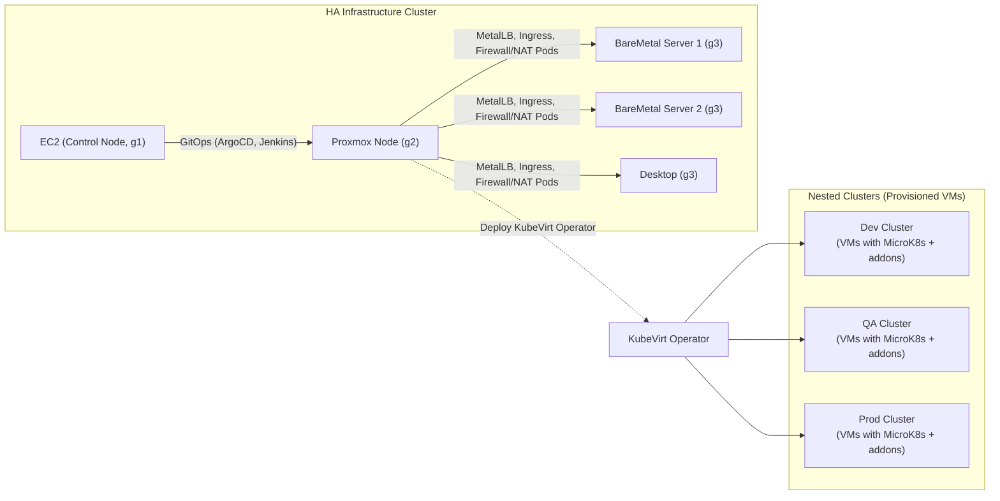
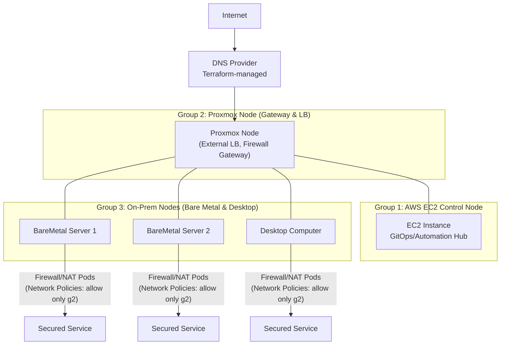
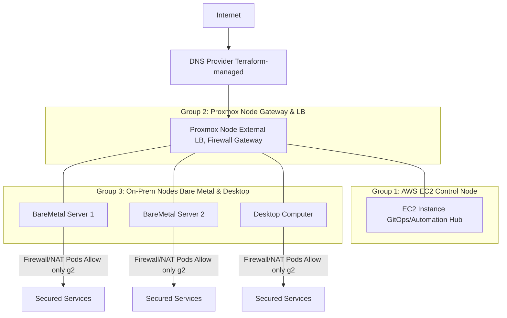
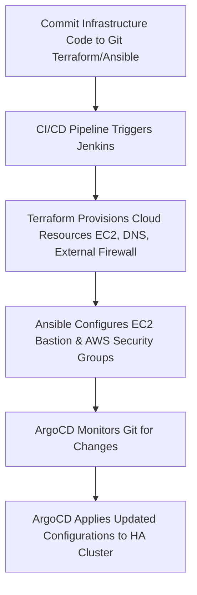
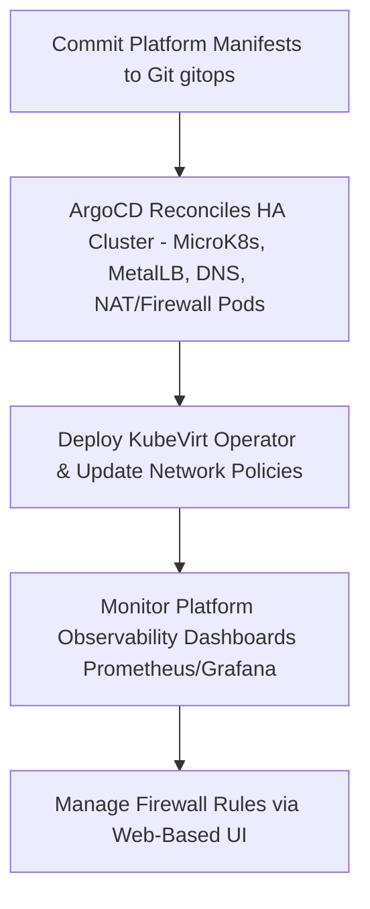
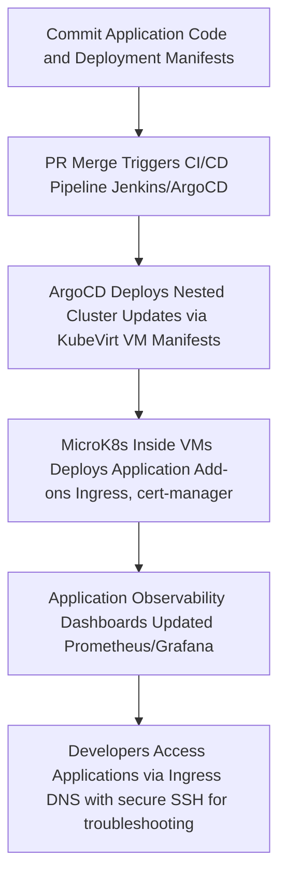
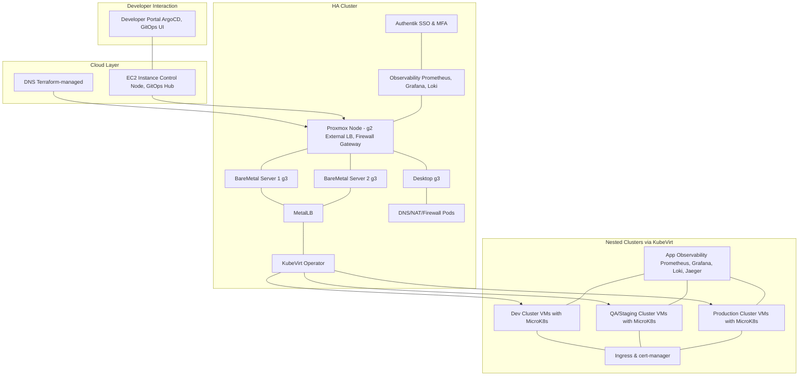

# Automated Cloud Infra, Platform Infra and Application Infra deployment




***




***


# RFC: Unified, Highly Available, GitOps‑Driven Cloud, Platform, and Application Infrastructure

## Leveraging MicroK8s, KubeVirt, and Multi‑Layered Security with Observability and Secure Access

**Authors:**\[Shaik Noorullah]

**Date:**&#x32;025-02-19

**Status:**&#x44;raft – For Review and Feedback


---
### Base Installation & Argocd

The main goal here is to deploy the infrastructure components to a HA microk8s cluster shown below with three master nodes, two of which have public IPs. but these public IPs are not internally assigned therefore, the cluster is unaware of the existence of these Public IPs.

The deployment plan I have is as follows:

##### Step 1:
- Verify that the microk8s cluster is vanilla deployment with no ingress/cert-manager or any of the components deployed as addons
- Verify that all network and other necessary components are running fine without errors
- deploy argocd base installation
- enable port forward so that the argo ui can be accessed through the Public IP.
- access the argocd UI through Public IP and login, then setup the creds for Repo access. (this action is preferred to be done automatically without having to access the argocd UI)

##### Step 2:
- After access to repo is given to argocd
- deploy the Root app of Root Apps


```markdown
okay, continuing with the 1st scenario ignore the other 2.

Let's dive deep:

now that we know how can we deploy argocd to the on-prem cluster, access it via the external IP (insecure) then deploy the ingress, cert-manager applications and secure the argocd UI with SSL.

This is all cool. But there's a problem,

1. Requires manual intervention
    
2. Depends on external dependencies (manifests, syntax, etc)
    
3. Does not follow GitOps principles
    
4. Can not be done in one go
    
5. Is not reproducible
    

Therefore, We need a way for us to:

1. create and deploy the kubernetes cluster (microk8s) through automation and to do this:
    
    1. We need to first bootstrap and prepare the servers
        
    2. Decide which ones are gonna be masters/loadBalancers/Workers
        
    3. Setup security, SSH access, etc
        
    4. Install necessary software, run diagnostics, enable firewall with required rules + allow ssh such that all the nodes that have the same role must have the same rules.
        
    5. Deploy the cluster (HA) with our configuration and wait for the cluster to be available
        
    6. Once the cluster is Available, we run some basic tests to actually test if it's healthy or not
        
    7. Once health checks are successful, we move to setting up Cilium for networking then again, testing and validating
        
    8. Once that's done, we then Deploy MetalLB with the configured IP range and then again testing and validating
        
2. Once MetalLB is available, we then automatically deploy ArgoCD (bare minimum and default deployment) once completed, and health checks are successful, setup load balancer and access it through the configured domain
    
3. After ArgoCD gets deployed and can be accessed, (mind you, the script is still running and it shows us the password for access) but does not require us to access the UI it automatically goes ahead and deploys the Root App of Root Apps. This Root App manages two sort of Root Apps:
    
    1. Argocd Self (root app that self manages argocd)
        
    2. Platform Root (root app that manages domain specific root applications)
        
4. Now, the Argocd Self app is not doing anything at the moment except of managing what was manual through the Application and the Platform Root App deploys the main core platform components divided by domains to the clusters here's the list of the Root Apps this Platform Root App will deploy:
    
    1. Root App Applications: manages all resources used by applications (our product - SaaS) and mainly manages 4 separate Kinds and those are:
        
        1. Databases:
            
            1. Persistent
                
                1. OLAP:
                    
                    1. TimeSeries: TimescaleDB
                        
                2. OLTP:
                    
                    1. Postgres (SQL+Vector+Graph)
                        
                    2. MongoDB (No SQL - Document/Json Store)
                        
                    3. CouchDB (Hybrid - mostly for realtime+reactive data)
                        
            2. Non Persistent (In-Memory):
                
                1. Redis (For caching, k/v store)
                    
                2. DiceDB (For reactive+realtime k/v store)
                    
        2. Artifacts:
            
            1. Package Repository: Verdaccio for js/ts packages & any other (please suggest) for python, go, rust. Minio as backend.
                
            2. GitLab for code repositories: (not required right now, we'll implement later in v3 or v4)
                
            3. Image Repository: Harbor with Minio as storage backend
                
        3. Communications:
            
            1. Events: (again, mind you these are just for the applications deployed might have multiple): Kafka
                
            2. Message Queues: for queues, Jobs, etc -> RabbitMQ
                
            3. Emails (for applications): Postal, Mailcow
                
        4. Gateway:
            
            1. Kong Api Gateway as a gateway, load balancer between services, databases, etc. (only svc level load balancing or maybe multi zone deployment in some other setting that you prefer to allow for global load balancing but not a priority right now
                
        5. Observability:
            
            1. Application Observability Stack: Distributed tracing, Logs and Metrics collection + dashboards to visualize, monitor and query. (Only Application Level, Database, Container, Svc and Deployment level Observability - The stack not yet decided needs to be simple, easy and flexible for future)
                
        6. Alerts & Notifications:
            
            1. Send crash reports, errors, logs, messages, over usage of resources, over utilization of resoruces, svc crashes, etc etc to slack, email and create issues on Github with proper tags.
                
    2. Root App: Infrastructure: This is perhaps the most important Root App we'll have this application is responsible for deploying the most basic requirements of any other App. for example: an application needs access to storage to deploy a database. (Root App: Applications) those databases (be it in any of the Domain Specific Root Apps) need access to storage, and that storage is given by this Root App. infact, the Underlying structure of the Volumes, Networking, VMs, MicroVMs, LoadBalancers, Ingress Controllers, etc, etc are all deployed through this application. Simply put, this application maintains the infrastructure needed for anything to work. The application domains it will manage are:
        
        1. Networking:
            
            1. LoadBalancing: MetalLB
                
            2. Ingress: Nginx
                
            3. SSL/HTTPS: Cert-Manager
                
            4. VM networking + Virtual Switches, etc: KubeOvn
                
            5. Networking Plugin Config: Cilium
                
            6. Network Monitoring: Kubenurse
                
            7. Firewall UI: (You Suggest)
                
        2. Storage:
            
            1. MicroCeph is deployed and configured externally (to get truly performant cluster on baremetal) and is consumed and controlled through rook-ceph deployment within cluster
                
            2. HA Minio for object Storage
                
            3. CephRBD for block Storage for Databases
                
            4. Ceph Dashboard and storage monitoring through either Ceph Dashboard or Custom tooling
                
        3. Compute
            
            1. KubeVirt for VMs
                
            2. FIrecracker for MicroVMs
                
            3. OpenWhisk for FaaS - exposes both UI and API layers to be usable by applications
                
            4. Observability and Monitoring of all Compute
                
        4. Security
            
            1. Identity Management and Access Control throughout: Keycloak or Authentik or Both
                
            2. Secrets Management: Bitnami Secrets Vault
                
        5. Backup & Restore
            
            1. Although Hardware Raid is available, Still take backups and send to offsight archives, incremental and consistent
                
        6. Alerts & Notifications:
            
            1. Fatal crashes, usage overflow, Resource consumption reports, deployments success | warnings | errors on infrastructure level - sent to slack, emails and creates Github issues with proper flags.
                
    3. Root App Workloads: The workloads root app is a special kind, the main agenda of this app is to deploy, manage and provide access to Workloads be it compute workloads, or ML workloads. for ML workloads, it Manages LLMs, Small-Medium ML models.
        
        1. vLLM for Distributed LLM Inference
            
        2. KubeRay as vLLM backend and for serving, training, data manipulation
            
        3. Model Repository something similar to In house hugging face (please suggest)
            
        4. Observability stack again for Workloads level monitoring and Observability
            
        5. Alerts & Notification similar to other Domain Specific Root Apps
            
    4. Root App Environments: This application is reponsible for tracking, managing and deploying anything to different environments/clusters eg: staging,dev, prod, etc.
        
        1. Clusters as a resource with auto scaling capability (deploy more VMs, etc)
            
        2. Maintains states of clusters: for example: the staging env must have the exact image of the production at every interval of 24 hrs (must be configurable) between this window, the developers can do what ever they want, every 24 hrs, the databases will revert to the production databases mirror.
            
        3. Cluster level observability, usage statistics, resource utilization, etc.
            
        4. Alerts & Notification just like all the other Domain Specific Applications
            
5. Once all these are successfully deployed (not exactly all but bare minimum working at least) then we can move forward with making sure the system is idempotent. for example if one step failed, and I fix the script or manifest or whatever it doesn't start from the beginning and try to deploy everything this will break things. the change flow must be very strong for the infrastructure.
    

Now based on the information I provided, I want you to do the following:

1. approach the plan with very logical, and critical thinking, functional thinking and criticism mindframe and not only establish a debating ground but also, provide suggestions and changes that can be made and allow me to approve/reject those.
    
2. Once I approve the changes/reject them, You must then go for writing 3 very detailed documents:
    
    1. RFC document for the complete infrastructure for ProficientNow
        
        1. Roadmap: divide every feature discussed into some structure were I can specific the priority, the stage and the version of the feature.
            
            1. each feature developed must be the least stage and the least version that is not yet developed with least priority. also, to avoid confusion later, define how these must be evaluated with plain english examples to show how these three properties for every feature must be developed.
                
    2. Technical Documentation/Specification + Risk analysis and Mitigation with Fallback & Fault Tolerant Mechanisms
        
    3. Architecture Diagrams (Mermaid):
        
        1. Heirarchical structure of the ArgoCD Applications, and Components deployed within etc
            
        2. Deployment Flow: Step 1 - Step N (how to deploy from start to finish with just one command)
            
        3. Project setup, Project Structure, Setting up Tools, etc
            
3. When the above is also done, we'll then start with the implementation:
    
    1. We'll focus on writing small parts that are deployable, testable and tangible progress. and repeat until we are were we want to be.
        

Let's start from 1. and then after my response, we can move forward. don't dump everything in one go.
```


***

## 1. Abstract

This document proposes a comprehensive architecture that unifies cloud, platform, and application infrastructures into a single, highly available system managed entirely by GitOps. The design uses MicroK8s deployed on nodes from three physically isolated groups:

* **g1:** AWS EC2 (control/automation hub, provisioner, master node) \[will be used to deploy the whole cloud platform]
* **g2:** 3 Proxmox Nodes (gateway, external load balancer (metalLB), firewall, kube-ovn) \[will be used for deploying underlying platform architecture for the 3 microk8s cluster (for application deployments) will host services like ceph, kube-ovn, kubevirt, cert-manager (for platform), ingress-nginx (for platform)] and
* **g3:** 3 On‑prem nodes (bare metal servers). \[will host the platform with three mikrok8 clusters on vms spanning all three nodes for dev, staging and prod environments]

Within the HA cluster, the KubeVirt operator provisions VMs as Kubernetes resources. These VMs, pre‑configured via cloud‑init, host nested MicroK8s clusters dedicated to development (dev), QA/staging, and production. In addition, a multi‑tier observability strategy is deployed at the cloud, platform, and application levels. Authentication and authorization are provided by authentik, while firewall rules are managed by a free, self‑hosted web‑based firewall management UI. Finally, secure SSH access is configured for both the overall groups and individual VMs.

***

## 2. Introduction

### 2.1 Background and Motivation

Modern infrastructure demands automation, high availability, security, and observability across all layers. With GitOps, declarative configuration, and container‑native virtualization, both VMs and containers can be managed as first‑class resources through Kubernetes APIs. This RFC outlines an architecture that:

* **Unifies** the management of cloud, platform, and application infrastructures.
* **Optimizes** high availability via three physically isolated groups (g1, g2, and g3).
* **Implements** GitOps with Terraform, Ansible, and ArgoCD.
* **Deploys** nested Kubernetes clusters via KubeVirt‑provisioned VMs with Rook-Ceph as storage backend for providing PV to VMs and uses kube-ovn for advanced isolated networking, multi-tier network segregation as per clusters with each mikrok8s cluster having different sub networks (using VLANs) for ceph, internal communication and external communication.
* **Secures** both external and internal traffic using in‑cluster firewall/NAT pods and strict network policies using kube-ovn.
* **Integrates** multi‑layer observability for cloud, platform, and application levels.
* **Enables** secure authentication/authorization via authentik.
* **Provides** centralized, self‑hosted firewall management and secure SSH access.

### 2.2 Scope

This document details:

* The complete system architecture and physical node grouping.
* The deployment of the HA MicroK8s cluster and nested clusters via KubeVirt.
* Observability strategies for cloud, platform, and application layers.
* Authentication and authorization (via authentik) and RBAC configuration.
* Firewall and network security (with a self‑hosted web GUI).
* SSH and secure remote access for both groups and individual VMs.
* Workflows for cloud engineers, platform engineers, and application developers.

### 2.3 Terminology

* **g1:** Group 1 – AWS EC2 instance (control/automation hub)
* **g2:** Group 2 – Proxmox node (gateway, external load balancer)
* **g3:** Group 3 – On‑prem nodes (bare metal servers and desktop computer)
* **HA Cluster:** The unified MicroK8s cluster spanning g1, g2, and g3.
* **KubeVirt:** Kubernetes operator that provisions VMs as custom resources.
* **GitOps:** Declarative configuration stored in Git and reconciled automatically.
* **Observability:** Monitoring, logging, and tracing at cloud, platform, and application layers.
* **Authentik:** Self‑hosted identity provider for authentication and authorization.
* **MetalLB:** Load-balancer for bare‑metal Kubernetes deployments.

***

## 3. System Overview

### 3.1 High-Level Architecture

The system is divided into three layers:

1. **Cloud Infrastructure Layer:**
    

* Managed via Terraform
* Includes external resources such as DNS and public IPs.
* Contains g1 (AWS EC2), which is hardened by AWS security groups.

1. **Platform Infrastructure Layer:**
    

* A highly available MicroK8s cluster spanning g1, g2, and g3.
* Runs critical services: MetalLB, DNS, NAT, firewall pods, GitOps tools (ArgoCD, Jenkins, KubeVirt, Kube-ovn, Ceph), and centralized observability.
* Deploys the KubeVirt operator for VM lifecycle management.

1. **Application Infrastructure Layer:**
    

* Nested clusters (dev, QA/staging, production) deployed as VMs via KubeVirt.
* Each VM is pre‑configured (via cloud‑init) with MicroK8s and its addon).
* Internal load balancing and additional security services are provided inside each nested cluster.

### 3.2 Node Grouping and Isolation

* **Group 1 (g1 – AWS EC2):**
   
  * Primary control/automation hub.
  * Secured by AWS Security Groups and strict firewall rules.
  * Runs GitOps tools (ArgoCD, Jenkins) and observability agents.
* **Group 2 (g2 – Proxmox Nodes):**
   
  * 1 node Functions as the gateway and external load balancer, another for CI/CD and dev tooling (Jenkins, js package repo, container image repo, knowledge base, documentation sites, etc.), and one will be used as an email server (Postal, Mailcow)
  * Hosts critical ingress components (MetalLB, ingress controllers).
  * Acts as the sole trusted ingress for g3.
* **Group 3 (g3 – Bare Metal):**
   
  * Consists of three bare metal servers.
  * Exposed with private/public IPs but hardened with in‑cluster firewall/NAT pods.
  * Enforces strict network policies allowing traffic only from g2.

Below is a diagram summarizing the grouping:



***

## 4. Detailed Architecture

### 4.1 Cloud Infrastructure (g1)

* **AWS EC2 Instance:**
   
  * **Role:** Primary control/automation node.
  * **Responsibilities:**
    * Hosts ArgoCD, Jenkins, and GitOps tooling.
    * Orchestrates deployments of cloud infrastructure, platform infrastructure and monitors Git repos.
    * Secured with AWS Security Groups and custom firewall rules.
  * **Access:**
    * Administrators use a bastion host with MFA-enabled SSH.
* **DNS Management:**
   
  * Terraform manages DNS (via Cloudflare/Route53).
  * Public subdomains point to the Proxmox node’s (g2) public IP.
  * All DNS records are version‑controlled in Git.

### 4.2 Platform Infrastructure (Unified HA Cluster: g1, g2, g3)

* **Unified MicroK8s Cluster:**
   
  * **Nodes:**
    * g1: EC2 instance (control plane).
    * g2: Three Proxmox nodes.
    * g3: Three bare metal servers.
  * **Core Services:**
    * **MetalLB:** Provides load balancing to expose services externally.
    * **DNS, NAT, and Firewall Pods:**
      * Deployed on every node.
      * g3 nodes enforce strict network policies (only allow traffic from g2).
    * **Observability Stack (Platform-Level):**
      * **Prometheus:** Collects cluster metrics.
      * **Grafana:** Visualizes dashboards.
      * **Loki/Fluentd:** Aggregates logs.
      * **Tempo/Jaeger:** Enables distributed tracing.
    * **Authentication & Authorization:**
      * **Authentik:** Self‑hosted identity provider for SSO and MFA.
      * **RBAC Policies:** Enforced within MicroK8s for role-based access.
    * **Firewall Management:**
      * A free, self‑hosted web‑based firewall management solution is deployed.
      * Provides a GUI for authorized engineers to manage and audit firewall rules.
    * **SSH & Remote Access:**
      * Bastion host on g1.
      * SSH keys are propagated via cloud‑init and configuration management.
      * Policies allow per‑group (g1, g2, g3) and per‑VM SSH access.
* **KubeVirt Operator:**
   
  * Installed within the HA cluster.
  * Manages VM lifecycle via GitOps.
  * All VM definitions (with cloud‑init data) are version‑controlled in Git and reconciled by ArgoCD.

### 4.3 Application Infrastructure (Nested Clusters via KubeVirt)

* **VM Provisioning via KubeVirt:**
  * **Deployment:**
    * VMs are created as Kubernetes custom resources.
    * YAML manifests include cloud‑init configurations for SSH keys, hostnames, etc.
  * **Nested Clusters:**
    * Organized into three groups:
      * **Dev Cluster**
      * **QA/Staging Cluster**
      * **Production Cluster**
  * **In‑VM MicroK8s:**
    * Each VM runs MicroK8s and enables built‑in addons:
      * Community ArgoCD, ingress, and cert‑manager.
      * Observability agents (node exporters, logging sidecars).
* **Observability at Application-Level:**
  * **Deployment:**
    * Each nested cluster has its own observability stack.
  * **Components:**
    * **Prometheus & Grafana:** For metrics and dashboards.
    * **Loki/Fluentd:** For log aggregation.
    * **Tempo/Jaeger:** For tracing application requests.
  * **Data Separation:**
    * Observability data is isolated per cluster for targeted alerts and troubleshooting.

***

## 5. Security and Access Control

### 5.1 Authentication & Authorization

* **Authentik:**
  * Deployed on the HA cluster.
  * Provides SSO and MFA for Cloud engineers, platform engineers, and Devops engineers.
  * Integrates with GitOps tools (ArgoCD, Jenkins) and the firewall management UI.
* **RBAC & Network Policies:**
  * Kubernetes RBAC enforces least privilege.
  * CNI plugin (kube-ovn) enforce strict network policies with isolated networks for internal traffic, external traffic, storage traffic (ceph):
  * g3 nodes accept traffic only from g2.
  * Nested clusters don't have ingress setup, they rely on the external (parent kubernetes cluster to provide the ssl)

### 5.2 Firewall and Network Security

* **External Firewall:**
  * Managed at the perimeter (via DNS/MetalLB).
  * Only permitted traffic reaches the HA cluster.
* **Internal Firewall/NAT Pods:**
  * Deployed on g3 nodes.
  * Enforce that only connections originating from g2 are accepted.
  * Firewall rules are managed via a self‑hosted, web‑based GUI.
* **Audit & Logging:**
  * All changes to firewall rules and NAT configurations are logged and monitored via the observability stack.

### 5.3 Secure SSH and Remote Access

* **Bastion Host (g1):**
  * Configured on the EC2 instance.
  * Multi‑factor authentication enforced.
* **Per‑Group and Per‑VM SSH:**
  * SSH key propagation via cloud‑init.
  * Fine‑grained access control enforced via authentik and RBAC.
  * Developers and engineers can SSH into nodes or individual VMs as needed.

***

## 6. Observability Strategy

Observability is implemented on three distinct levels:

### 6.1 Cloud-Level Observability

* **Scope:**
  * Monitors external resources (AWS EC2, DNS endpoints).
* **Components:**
  * Prometheus for cloud metrics.
  * Grafana dashboards for infrastructure health.
  * Integration with AWS CloudWatch where applicable.
  * Forwarding logs into the HA cluster’s logging stack.

### 6.2 Platform-Level Observability

* **Scope:**
  * Monitors the HA cluster (g1, g2, g3).
  * Captures metrics from Kubernetes, MicroK8s, and core services.
* **Components:**
  * Prometheus, Grafana, and Alertmanager (deployed as pods).
  * Loki or Fluentd for log aggregation.
  * Tempo or Jaeger for distributed tracing.

### 6.3 Application-Level Observability

* **Scope:**
  * Monitors each nested cluster (Dev, QA/Staging, Production).
  * Captures application metrics, logs, and traces.
* **Components:**
  * Dedicated Prometheus and Grafana instances per cluster.
  * Loki/Fluentd and Tempo/Jaeger integrated for logs and tracing.
* **Data Segregation:**
  * Each nested cluster’s observability data is isolated, enabling targeted alerts.

***

## 7. GitOps and Continuous Deployment

* **Source of Truth:**
  * All configurations (Terraform, Ansible, Kubernetes manifests) are stored in Git.
* **Automation:**
  * ArgoCD continuously reconciles the desired state.
  * Jenkins (or a similar CI/CD tool) on the EC2 automation hub triggers pipelines on PR merges.
* **Declarative VM Provisioning:**
  * KubeVirt VM definitions are managed as code and applied automatically.
* **Observability & Security:**
  * All network policies, firewall rules, and observability configurations are version‑controlled.

***

## 8. Workflows

### 8.1 Cloud Engineer’s Workflow



***Explanation**:Cloud engineers commit changes that update external resources. CI/CD pipelines provision these changes via Terraform/Ansible, and ArgoCD reconciles the HA cluster state accordingly.*

***

### 8.2 Platform Engineer’s Workflow



***Explanation**: Platform engineers manage the core services in the HA cluster, update network policies, deploy KubeVirt, and use observability dashboards to monitor system health. They also use the firewall management UI to adjust security settings.*


### 8.3 Application Developer’s Workflow



***Explanation**:Application developers commit code and deployment manifests. The GitOps pipeline ensures that nested clusters (dev, QA, production) are updated via KubeVirt, and applications are deployed with integrated ingress and observability. Developers can access the applications (and SSH into VMs if needed) for troubleshooting.*

***

### 8.4 Complete Kubernetes Structure Diagram



*Explanation:*&#x54;his diagram shows the full Kubernetes stack. At the top (cloud layer), DNS and the AWS EC2 instance (control node) are managed by Terraform. The platform layer (HA cluster) spans Proxmox, bare metal, and desktop nodes running core services such as MetalLB, NAT/firewall pods, observability, and authentik. The KubeVirt operator provisions nested clusters (dev, QA, production) where each VM runs MicroK8s with its own ingress, cert-manager, and observability agents. Developers interact with the system via the GitOps UI and developer portal.

***

## 9. Deployment and Rollout Plan

### 9.1 Pre‑Deployment Preparations

* **Environment Setup:**
  * Provision AWS EC2 instance, Proxmox nodes, bare metal servers.
  * Configure static IPs, VLANs, and network isolation on all nodes.
  * Create user on each node for secure access, setup ssh connection, add user to important groups, install required packages, prepare each node, test the readiness of each node.
* **Tooling Installation:**
  * Install MicroK8s, Terraform, Ansible, and GitOps tools on each node.

### 9.2 Step‑by‑Step Deployment

1. **Provision Cloud Resources:**

* Use Terraform to create the EC2 instance, DNS records.

1. **Bootstrap the HA Cluster:**

* Install Kubernetes on all nodes (g1, g2, g3) and join them into one HA cluster, using KubeKey.

1. **Deploy Core Services:**

* Deploy MetalLB, NAT/firewall pods, Ingress, Ceph, Cert-manager, Kube-Ovn, KubeVirt, ArgoCD, Authentik and create Ceph Cluster and create Persistent Volumes to be used by other services. deploy databases (HA pg cluster, HA Redis cluster & Etcd) using ceph-volumes with PVCs which applications like Authentik, etc will use in the HA cluster.
* Enforce network policies on g3 to allow traffic only from g2.

1. **Deploy GitOps Components:**

* Install ArgoCD on the EC2 instance.
* Configure authentik and RBAC policies.

1. **Install KubeVirt Operator:**

* Deploy KubeVirt within the HA cluster.
* Create Git-managed manifests for VM definitions.

1. **Provision Nested Clusters via KubeVirt:**

* Use ArgoCD to apply KubeVirt VM manifests.
* Automate MicroK8s installation as separate clusters in VMs via cloud‑init/Ansible.
* Organize VMs into dev, QA/staging, and production clusters.

1. **Deploy Application Services:**

* Enable ingress (with cert‑manager) inside nested clusters.
* Deploy application-level observability stacks (Prometheus, Grafana, Loki, Jaeger).

1. **Deploy Additional Infrastructure:**

* Install the self‑hosted firewall management UI.
* Configure SSH access (bastion host, key propagation, MFA via authentik).

1. **Testing and Validation:**

* Validate end‑to‑end connectivity: Internet → DNS → MetalLB (g2) → g3 nodes → nested clusters.
* Validate firewall rule audits, and SSH access.

1. **Rollout and Monitoring:**

* Gradually transition workloads.
* Monitor logs, metrics, and network activity.

***

## 10. Maintenance and Operational Considerations

* **Upgrades & Rollbacks:**
  * Use GitOps (ArgoCD) to apply versioned changes; rollbacks are simple via Git history.
* **Monitoring & Alerting:**
  * Define comprehensive dashboards and alerts for all layers.
* **Security Auditing:**
  * Regular audits of firewall rules, network policies, RBAC settings, and authentik logs.
* **Documentation & Training:**
  * Maintain detailed documentation and provide training sessions for cloud, platform, and application teams.

***

## 11. Workflows Summary

### Cloud Engineer Workflow:

1. Commit Terraform/Ansible code to Git.
2. CI/CD pipeline triggers resource provisioning (EC2, DNS, external firewall).
3. ArgoCD monitors Git and applies changes to the HA cluster.

### Platform Engineer Workflow:

1. Commit platform manifests (MicroK8s core services, MetalLB, NAT/firewall, KubeVirt).
2. ArgoCD reconciles changes in the HA cluster.
3. Manage firewall rules via the web‑based firewall UI.
4. Monitor observability dashboards for cluster health.

### Application Developer Workflow:

1. Commit application code and deployment manifests.
2. CI/CD (Jenkins/ArgoCD) deploys changes to nested clusters via KubeVirt.
3. Applications are exposed via ingress with cert‑manager.
4. Observability dashboards in nested clusters monitor application health.
5. Developers SSH into VMs as needed using secure credentials.

***

## 12. Conclusion

This RFC presents a unified, GitOps‑driven infrastructure that spans cloud, platform, and application layers. By leveraging MicroK8s, KubeVirt, and a comprehensive observability stack, the proposed architecture ensures high availability, scalability, and robust security. Authentication via authentik, centralized firewall management via a self‑hosted web GUI, and secure SSH access complete the solution. The design is fully declarative, version‑controlled, and supports distinct workflows for cloud engineers, platform engineers, and application developers—ensuring a maintainable and reproducible infrastructure over the long term.

***

## 13. References

1. [MicroK8s Documentation](https://microk8s.io/docs)
2. [KubeVirt Official Guides](https://kubevirt.io/user-guide/)
3. [MetalLB Documentation](https://metallb.universe.tf/)
4. [ArgoCD Documentation](https://argo-cd.readthedocs.io/)
5. [GitOps Best Practices](https://www.weave.works/technologies/gitops/)
6. [Authentik Documentation](https://goauthentik.io/docs/)
7. [Prometheus, Grafana, Loki, Tempo, and Jaeger Documentation](https://prometheus.io/)


***

### 14. Project Structure & Git Repo

```
Unified-HA-Infrastructure/
├── .github/                            
│   └── workflows/                     # CI/CD workflows: Terraform plan, Ansible lint, K8s manifest validations
│       ├── terraform-plan.yml  
│       ├── ansible-lint.yml    
│       └── k8s-manifests.yml   
│
├── cloud/                             # Cloud Tier: External provisioning and node bootstrapping
│   ├── terraform/                     # Terraform code for cloud resources (VPC, EC2, DNS)
│   │   ├── modules/                   # Reusable modules (e.g. aws-vpc, proxmox-vm, common)
│   │   │   ├── aws-vpc/
│   │   │   ├── proxmox-vm/
│   │   │   └── common/
│   │   ├── cloud/                     # Cloud-specific resources (AWS, DNS)
│   │   │   ├── dev/
│   │   │   ├── staging/
│   │   │   └── prod/
│   │   └── onprem/                    # On-prem resources (for Proxmox, etc.)
│   ├── ansible/                       # Ansible playbooks & roles to configure nodes (g1, g2, g3)
│   │   ├── inventories/               # Inventories with group_vars/host_vars per node group (g1: AWS, g2: Proxmox, g3: bare metal)
│   │   │   ├── g1/
│   │   │   ├── g2/
│   │   │   └── g3/
│   │   ├── playbooks/                 
│   │   │   ├── bootstrap.yml          # Initial configuration (user creation, SSH, packages)
│   │   │   ├── configure-ec2.yml      # Configuration for g1 nodes
│   │   │   ├── configure-proxmox.yml  # Configuration for g2 nodes
│   │   │   └── configure-baremetal.yml# Configuration for g3 nodes
│   │   └── roles/                     # Reusable roles (e.g. microk8s, firewall, ssh-setup)
│   └── scripts/                       # Helper scripts for provisioning tasks
│       └── provision.sh               
│
├── platform/                          # Platform Tier: HA Cluster across g1, g2, g3
│   ├── gitops/                        # ArgoCD definitions for core platform services
│   │   ├── argocd-apps/               # ArgoCD Application CRs for:
│   │   │   ├── core-services.yaml     # Namespaces, RBAC, base deployments
│   │   │   ├── network.yaml           # kube-ovn, MetalLB, NAT/firewall pods
│   │   │   ├── observability.yaml     # Prometheus, Grafana, Loki, etc.
│   │   │   ├── authentication.yaml    # Authentik & RBAC policies for SSO/MFA
│   │   │   └── argocd-self.yaml       # Self-management for ArgoCD
│   │   └── manifests/                 # Raw Kubernetes manifests for HA cluster resources
│   │       ├── namespaces.yaml        
│   │       ├── kube-ovn.yaml          
│   │       ├── metallb.yaml           
│   │       ├── ingress-nginx.yaml     
│   │       └── additional-crds/       # CRDs for observability, firewall management, etc.
│   ├── overlays/                      # Optional environment overlays if platform configs vary
│   └── docs/                          # Platform-specific documentation (e.g., platform-guide.md)
│
├── application/                       # Application Tier: Nested clusters provisioned via KubeVirt
│   ├── gitops/                        # ArgoCD definitions for nested clusters
│   │   ├── dev/                     
│   │   │   ├── base.yaml            # Base manifests for the Dev cluster (namespaces, ingress, etc.)
│   │   │   └── overlays/            # Dev-specific overrides
│   │   ├── staging/
│   │   │   ├── base.yaml
│   │   │   └── overlays/
│   │   └── prod/
│   │       ├── base.yaml
│   │       └── overlays/
│   └── manifests/                    # Additional application-level Kubernetes manifests
│       └── common/                  
│           └── app-templates/        # Templates for application deployments
│
├── kubevirt/                          # KubeVirt: VM operator and VM definitions managed via GitOps
│   ├── operator/                      # Manifest to deploy the KubeVirt operator
│   └── vm-definitions/                # VM manifests for nested clusters (organized by environment)
│       ├── dev/
│       ├── staging/
│       └── prod/
│
├── fuma-docs/                         # Documentation website code (e.g., Hugo, Jekyll)
│   ├── content/                       
│   ├── layouts/
│   ├── static/
│   └── config.toml                    # Site configuration
│
├── observability/                     # Observability configurations for all tiers
│   ├── cloud/                        # Cloud-level dashboards & alerts (e.g., AWS/EC2)
│   ├── platform/                     # HA cluster observability (Prometheus, Grafana, Loki)
│   └── application/                  # Nested cluster observability stacks
│
├── auth/                              # Authentication and SSO configurations (Authentik)
│   ├── policies/                      # RBAC and access control manifests
│   └── sso/                           # SSO integration manifests
│
├── firewall/                          # Firewall rules and self-hosted UI configurations
│   ├── network-policies/              # Kubernetes NetworkPolicy manifests
│   └── gui-rules/                     # Firewall UI configuration files (JSON/YAML)
│
├── scripts/                           # Helper scripts used across tiers (deployment, backup, etc.)
│   ├── bootstrap-ha-cluster.sh
│   └── deploy-kubevirt-vms.sh
│
├── common/                            # Common/shared resources for the repo
│   ├── README.md                      # Repository overview (could also be at root)
│   ├── CHANGELOG.md                   
│   ├── LICENSE                        
│   └── scripts/                       # Reusable helper scripts across tiers
│       └── utils.sh                   
│
├── docs/                              # Overall project documentation and RFCs
│   ├── RFCs/
│   │   └── Cloud-Infra-RFC-0001.md     
│   └── architecture/                  # Diagrams and high-level design documents
│
└── .gitignore                         # Root-level .gitignore

```

***
