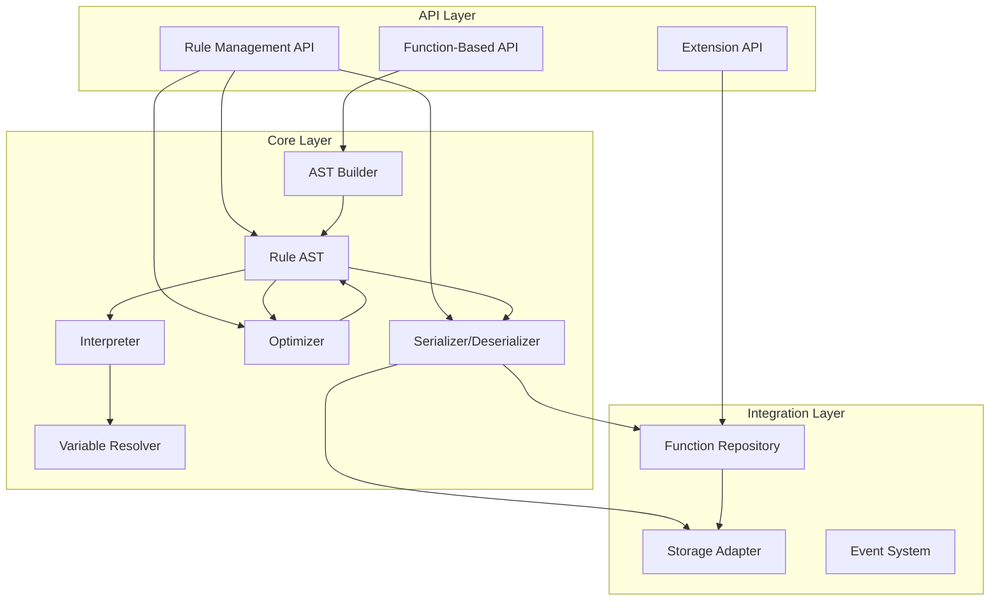
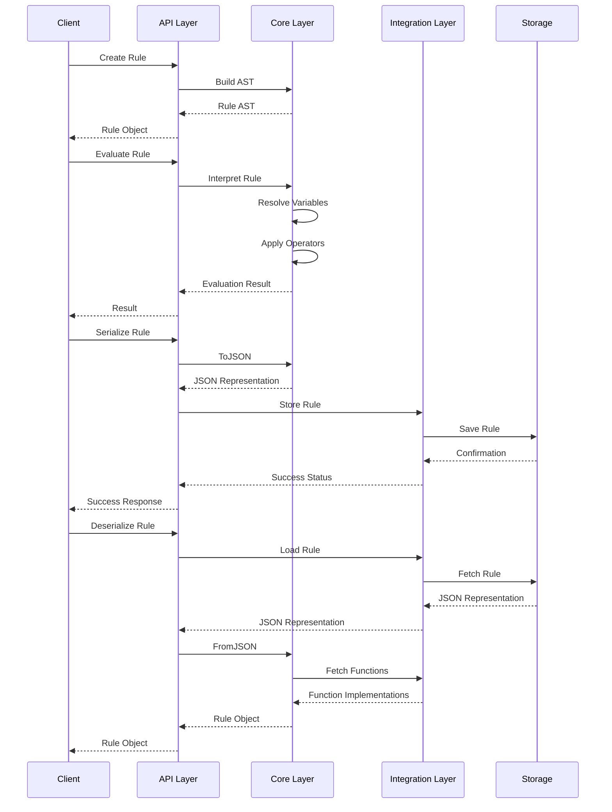

# Technical Specification: Dynamic Rule Engine

## 1. Overview

This document details the technical architecture and implementation specifics for the Dynamic Rule Engine, a TypeScript/JavaScript library that enables the creation, evaluation, and management of business rules through an intuitive function-based API with a powerful AST-based internal representation.

## 2. Architecture

### 2.1 System Architecture

The rule engine is built using a layered architecture with the following components:



### 2.2 Component Descriptions

1. **Function-Based API**: The primary interface for creating rules using a fluent, intuitive syntax
2. **Rule Management API**: Interface for serializing, deserializing, and optimizing rules
3. **Extension API**: Interface for adding custom operators and functions
4. **AST Builder**: Converts function calls to AST nodes
5. **Rule AST**: Internal representation of rules as a tree structure
6. **Interpreter**: Evaluates rules against a context
7. **Variable Resolver**: Resolves variable references within a context
8. **Optimizer**: Improves rule performance through transformations
9. **Serializer/Deserializer**: Converts rules to/from JSON format
10. **Function Repository**: Stores and retrieves function implementations
11. **Storage Adapter**: Interfaces with external storage (MinIO)
12. **Event System**: Publishes events for rule lifecycle activities

### 2.3 Data Flow



## 3. Core Components

### 3.1 Rule AST

#### 3.1.1 Condition Base Class

```typescript
export abstract class Condition<T = unknown> {
  constructor(
    public readonly operator: string,
    public readonly value: T
  ) {}
  
  // Metadata for debugging and explanation
  private _notes: Note[] = [];
  
  public addNote(note: Note): void {
    this._notes.push(note);
  }
  
  public get notes(): ReadonlyArray<Note> {
    return this._notes;
  }
}

export interface Note {
  type: string;
  message?: string;
  originalValue?: any;
}
```

#### 3.1.2 Condition Types

```typescript
export class FieldCondition<T = unknown> extends Condition<T> {
  constructor(
    operator: string,
    public readonly field: string,
    value: T
  ) {
    super(operator, value);
  }
}

export class CompoundCondition<T extends Condition = Condition> extends Condition<T[]> {
  constructor(operator: string, conditions: T[]) {
    if (!Array.isArray(conditions)) {
      throw new Error(`"${operator}" operator expects to receive an array of conditions`);
    }
    super(operator, conditions);
  }
}

export class DocumentCondition<T = unknown> extends Condition<T> {
  constructor(operator: string, value: T) {
    super(operator, value);
  }
}
```

### 3.2 Variable Resolver

```typescript
export class VariableResolver {
  /**
   * Determines if a string is a variable reference (starts with $)
   */
  public static isVariableReference(value: any): boolean {
    return typeof value === 'string' && value.startsWith('$');
  }

  /**
   * Resolves a variable reference in the given context
   */
  public static resolveVariable(variableRef: string, context: EvaluationContext): any {
    // Remove the $ prefix
    const path = variableRef.substring(1);
    return getValueByPath(context, path, defaultGetter);
  }

  /**
   * Resolves a value if it's a variable reference, otherwise returns it as-is
   */
  public static resolveValue(value: any, context: EvaluationContext): any {
    if (this.isVariableReference(value)) {
      return this.resolveVariable(value, context);
    }
    return value;
  }
}

/**
 * Gets a value from an object using dot notation path
 */
export function getValueByPath(object: any, path: string, getter: GetterFunction): any {
  if (path === '') return object;
  
  const parts = path.split('.');
  let current = object;
  
  for (let i = 0; i < parts.length; i++) {
    const part = parts[i];
    
    if (current === null || current === undefined) {
      return undefined;
    }
    
    // Handle array traversal
    if (Array.isArray(current) && isNaN(Number(part))) {
      return current.flatMap(item => {
        const value = getter(item, part);
        return value !== undefined ? value : [];
      });
    }
    
    current = getter(current, part);
  }
  
  return current;
}
```

### 3.3 Function-Based API

```typescript
// Example implementation for the NUMBER.GREATER_THAN function
export function greaterThan(value: number, field: string): RuleFunction {
  // Create the AST node
  const condition = new FieldCondition('GREATER_THAN', field, value);
  
  // Create the evaluation function
  const evaluator = (context: EvaluationContext): boolean => {
    const resolvedField = VariableResolver.resolveValue(field, context);
    const resolvedValue = VariableResolver.resolveValue(value, context);
    
    if (typeof resolvedField !== 'number') {
      return false;
    }
    
    return resolvedField > resolvedValue;
  };
  
  // Return the rule function with attached AST
  const ruleFunction = evaluator as RuleFunction;
  ruleFunction.ast = condition;
  
  return ruleFunction;
}

// Define the type for a rule function
export interface RuleFunction {
  (context: EvaluationContext): boolean;
  ast: Condition;
}

// Export the organized function structure
export const functions = {
  NUMBER: {
    GREATER_THAN: greaterThan,
    // Other number functions...
  },
  STRING: {
    CONTAINS: contains,
    // Other string functions...
  },
  COMMON: {
    AND: and,
    OR: or,
    // Other common functions...
  },
  // Other categories...
};
```

### 3.4 Rule Engine

```typescript

```
