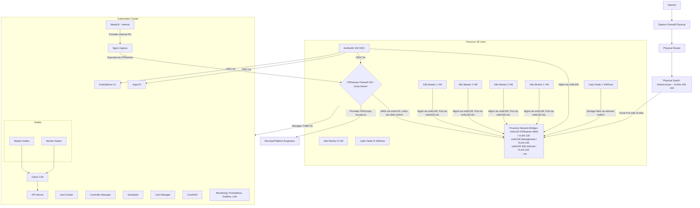
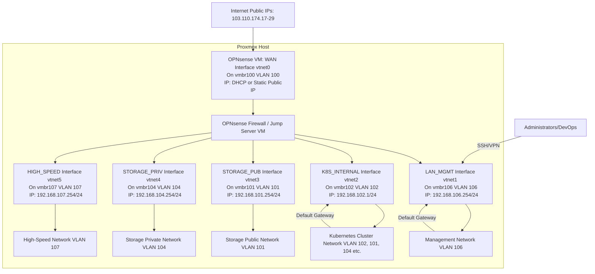

# Comprehensive Kubernetes Infrastructure and Network Deployment Plan (Stages 1-4)

## Table of Contents

## 1. Introduction and Architecture Overview

### 1.1. Goals and Objectives

This document outlines the comprehensive plan for deploying and managing a resilient, scalable, and secure Kubernetes infrastructure on Proxmox VE. The key objectives are:

- **Automation:** Automate the provisioning and configuration of the Proxmox hosts, networking, core service VMs (Firewall, Authentication), and the Kubernetes cluster itself.
- **Security:** Implement a robust security posture with a dedicated firewall, network segmentation, network policies, OIDC authentication, and continuous monitoring.
- **Scalability:** Design the infrastructure to scale horizontally to accommodate growing workloads.
- **High Availability:** Ensure high availability for the control plane, applications, and critical network services.
- **Observability:** Establish comprehensive monitoring, logging, and tracing for the entire stack.
- **GitOps:** Manage all infrastructure and application configurations through GitOps principles.
- **Isolation:** Ensure the Kubernetes networking infrastructure is logically separated and does not interfere with other existing workloads on Proxmox.


### 1.2. Overall Architecture Diagram



### 1.3. Technology Stack

- **Virtualization:** Proxmox VE
- **Infrastructure as Code (IaC):** Terraform (for Proxmox VM provisioning)
- **Configuration Management:** Ansible (for VM preparation, Proxmox host networking, OPNsense setup)
- **Kubernetes Distribution:** KubeKey (for Kubernetes and KubeSphere deployment)
- **Container Runtime:** Containerd
- **CNI:** Cilium (with eBPF, Hubble, WireGuard)
- **Service Mesh:** (Optional, Istio or Linkerd can be integrated later)
- **Load Balancer (External):** OPNsense (NAT, Port Forwarding, HA with CARP)
- **Load Balancer (Internal K8s):** MetalLB (L2 mode)
- **Ingress Controller:** Nginx Ingress
- **Certificate Management:** Cert-Manager with Let's Encrypt
- **Firewall/Router/VPN:** OPNsense
- **Authentication:** Authentik (OIDC)
- **Storage:** Ceph (managed by Rook)
- **GitOps:** ArgoCD
- **Monitoring:** Prometheus, Grafana, Alertmanager
- **Logging:** Loki, Promtail
- **Tracing:** Tempo (optional, for application-level tracing)
- **Nested Virtualization (Optional):** Kube-OVN, VyOS (if extensive nested clusters are needed)

## 2. Physical Network and Proxmox Host Configuration

### 2.1. Existing Physical Switch Configuration (Reference)

The physical network switches have been pre-configured by the network administration team. The configuration includes the necessary VLANs, trunk ports, and inter-VLAN routing policies at the switch/firewall level. This plan focuses on automating the configuration _from the Proxmox host upwards_.

**Key VLANs (as per provided information):**

| **VLAN ID** | **Purpose**         | **IP Range**       | **Gateway**     | **Internet Access** | **Notes**                                            |
| ----------- | ------------------- | ------------------ | --------------- | ------------------- | ---------------------------------------------------- |
| 100         | Public Traffic      | `192.168.100.0/24` | `192.168.100.1` | Yes                 | External access, API endpoints, OPNsense WAN         |
| 101         | Storage Public      | `192.168.101.0/24` | `192.168.101.1` | Yes                 | Ceph public network                                  |
| 102         | Internal Traffic    | `192.168.102.0/24` | `192.168.102.1` | No                  | Private cluster communication, K8s internal services |
| 104         | Storage Private     | `192.168.104.0/24` | `192.168.104.1` | No                  | Ceph private/replication network                     |
| 105         | Nested Clusters     | `192.168.105.0/24` | `192.168.105.1` | Yes                 | For nested Kubernetes implementations (if used)      |
| 106         | Management          | `192.168.106.0/24` | `192.168.106.1` | No                  | Proxmox host management, Node management, Authentik  |
| 107         | High-Speed External | `192.168.107.0/24` | `192.168.107.1` | Yes                 | Optimized route for specific services (via OPNsense) |
| 108         | Nested Cluster Apps | `192.168.108.0/24` | `192.168.108.1` | Yes                 | Application tier for nested K8s (if used)            |
| 109         | Nested Cluster Data | `192.168.109.0/24` | `192.168.109.1` | No                  | Data tier for nested K8s (if used)                   |

**Switch Port Configuration (Summary from Email):**

- Ports connected to Proxmox hosts (e.g., `1/0/1`, `1/0/3`) are configured as trunk ports allowing all necessary VLANs (100-109).
- Uplink to the main corporate firewall/router is configured.
- Inter-VLAN routing is handled by the corporate firewall, but OPNsense will add another layer of control for traffic entering/leaving the Kubernetes ecosystem.

### 2.2. Automated Proxmox Host Network Configuration

The Proxmox host's network interfaces (`/etc/network/interfaces`) will be configured automatically using Ansible. This ensures consistency and allows for version-controlled network definitions.

#### 2.2.1. Proxmox Host Network Requirements

Each Proxmox host will require:

- A management interface (typically on an untagged VLAN or a dedicated management VLAN, e.g., VLAN 106).
- Linux bridges for each VLAN that VMs will connect to (e.g., `vmbr100`, `vmbr101`, `vmbr106`).
- The physical NIC(s) connected to the trunk ports on the switch will be part of these bridges.

**Example Proxmox Host IP Assignment (Static):**

- `vmbr106` (Management Bridge for VLAN 106): `192.168.106.X/24` (where X is unique per host)
- Other bridges (`vmbr100`, `vmbr101`, etc.) will not have IP addresses on the Proxmox host itself; they will just bridge traffic for VMs. The OPNsense VM and Kubernetes nodes will have IPs on these VLANs.
#### 2.2.2. Ansible for Proxmox Host Networking (Bridge Creation Prerequisite)

An Ansible playbook will manage `/etc/network/interfaces` on each Proxmox host to create the necessary Linux bridges (e.g., `vmbr100`, `vmbr106`, `vmbr102`). **This step is a prerequisite and must be completed before provisioning VMs with Terraform that will attach to these bridges.**

**Ansible Playbook Snippet (`proxmox_networking.yml`):**

```
---
- hosts: proxmox_hosts
  become: true
  vars:
    # Define physical interfaces used for trunking
    # This might vary per host or be a list if bonding is used
    trunk_interface: "eno1" # Example, adjust as per your host
    management_vlan_id: 106
    management_ip_suffix: "{{ ansible_play_hosts.index(inventory_hostname) + 5 }}" # e.g., .5, .6, ...
    management_gateway: "192.168.106.1"
    vlans_to_bridge:
      - 100
      - 101
      - 102
      - 104
      - 105
      # - 106 # Management VLAN bridge is handled separately if it needs an IP on the host
      - 107
      - 108
      - 109

  tasks:
    - name: Ensure networking packages are present
      apt:
        name: ["vlan", "bridge-utils"]
        state: present

    - name: Configure /etc/network/interfaces to create bridges
      template:
        src: templates/interfaces.j2
        dest: /etc/network/interfaces
        owner: root
        group: root
        mode: '0644'
      notify: restart networking

    - name: Ensure networking service is enabled and started (Debian/Ubuntu)
      service:
        name: networking
        state: started
        enabled: yes
      when: ansible_os_family == "Debian"

  handlers:
    - name: restart networking
      service:
        name: networking
        state: restarted
      when: ansible_os_family == "Debian"
```

**Ansible Template (`templates/interfaces.j2`):**

```
# This file is managed by Ansible. Do not edit manually.
auto lo
iface lo inet loopback

# Physical Trunk Interface (e.g., eno1)
auto {{ trunk_interface }}
iface {{ trunk_interface }} inet manual
# For bonding, you would configure bond slaves here and then the bond interface

# Management Bridge (VLAN {{ management_vlan_id }}) with IP on Proxmox Host
auto vmbr{{ management_vlan_id }}
iface vmbr{{ management_vlan_id }} inet static
    address 192.168.{{ management_vlan_id }}.{{ management_ip_suffix }}/24
    gateway {{ management_gateway }}
    bridge-ports {{ trunk_interface }}.{{ management_vlan_id }}
    bridge-stp off
    bridge-fd 0
    # This bridge is for Proxmox host management and can also be used by VMs on this management network.

# --- Bridge Creation for VM Connectivity ---
# The following bridges are primarily for VM network attachments.
# They typically do not have an IP address on the Proxmox host itself,
# unless the host needs to directly communicate on that VLAN for other reasons.

# Main trunk-aware bridge (Optional, if VMs are VLAN-aware themselves)
# auto vmbr0
# iface vmbr0 inet manual
#     bridge-ports {{ trunk_interface }}
#     bridge-stp off
#     bridge-fd 0
#     bridge-vlan-aware yes
#     bridge-vids 2-4094 # Or a more specific list if needed

# Individual Linux Bridges for each VLAN (Simpler for VMs not managing their own VLAN tags)

auto vmbr{{ vlan_id }}
iface vmbr{{ vlan_id }} inet manual
    bridge-ports {{ trunk_interface }}.{{ vlan_id }}
    bridge-stp off
    bridge-fd 0
    # VMs will connect their NICs to this bridge for VLAN {{ vlan_id }} access

```

_The template above creates individual bridges (`vmbr<VLAN_ID>`) for each specified VLAN. These are the bridges that VMs will connect to. The Proxmox host itself only gets an IP on `vmbr{{ management_vlan_id }}`._

#### 2.2.3. Proxmox Host Network Diagram

```mermaid
graph TD
    subgraph ProxmoxHost1 [Proxmox Host 1]
        PVE_OS[Proxmox VE OS]
        PHY_NIC1[Physical NIC 1]
        
        PVE_OS -- Manages --> PHY_NIC1

        Bridge_MGMT[vmbr106 VLAN 106 192.168.106.5/24 192.168.106.1]
        Bridge_V100[vmbr100 VLAN 100]
        Bridge_V101[vmbr101 VLAN 101]
        Bridge_V102[vmbr102 VLAN 102]
        Bridge_V104[vmbr104 VLAN 104]
        Bridge_V105[vmbr105 VLAN 105]
        Bridge_V107[vmbr107 VLAN 107]
        Bridge_V108[vmbr108 VLAN 108]
        Bridge_V109[vmbr109 VLAN 109]

        PHY_NIC1 -- Tagged Traffic --> VLAN106_IF[eno1.106]
        PHY_NIC1 -- Tagged Traffic --> VLAN100_IF[eno1.100]
        PHY_NIC1 -- Tagged Traffic --> VLAN101_IF[eno1.101]
        PHY_NIC1 -- Tagged Traffic --> VLAN102_IF[eno1.102]
        PHY_NIC1 -- Tagged Traffic --> VLAN104_IF[eno1.104]
        PHY_NIC1 -- Tagged Traffic --> VLAN105_IF[eno1.105]
        PHY_NIC1 -- Tagged Traffic --> VLAN107_IF[eno1.107]
        PHY_NIC1 -- Tagged Traffic --> VLAN108_IF[eno1.108]
        PHY_NIC1 -- Tagged Traffic --> VLAN109_IF[eno1.109]

        VLAN106_IF --> Bridge_MGMT
        VLAN100_IF --> Bridge_V100
        VLAN101_IF --> Bridge_V101
        VLAN102_IF --> Bridge_V102
        VLAN104_IF --> Bridge_V104
        VLAN105_IF --> Bridge_V105
        VLAN107_IF --> Bridge_V107
        VLAN108_IF --> Bridge_V108
        VLAN109_IF --> Bridge_V109
        
        PVE_OS -- Access via --> Bridge_MGMT

        VM1_NIC1[VM1 NIC OPNsense WAN] --> Bridge_V100
        VM1_NIC2[VM1 NIC OPNsense LAN_MGMT] --> Bridge_MGMT
        VM1_NIC3[VM1 NIC OPNsense K8S_INTERNAL] --> Bridge_V102
        VM1_NIC4[VM1 NIC OPNsense STORAGE_PUB] --> Bridge_V101
        VM1_NIC5[VM1 NIC OPNsense STORAGE_PRIV] --> Bridge_V104
        VM1_NIC_HS[VM1 NIC OPNsense HIGH_SPEED] --> Bridge_V107


        K8SNode_VM_NIC1[K8s Node VM NIC Management] --> Bridge_MGMT
        K8SNode_VM_NIC2[K8s Node VM NIC Pod Traffic] --> Bridge_V102
        K8SNode_VM_NIC3[K8s Node VM NIC Ceph Public] --> Bridge_V101
        K8SNode_VM_NIC4[K8s Node VM NIC Ceph Private] --> Bridge_V104

    end
    
    PHY_NIC1 --> PhysicalSwitch[Physical Switch Trunk Port];
    PhysicalSwitch --> VLANsTrunked[VLANs 100-109 Trunked];
```



### 2.3. Network Isolation on Proxmox

The Kubernetes infrastructure network is isolated from other potential VMs on the Proxmox cluster through several mechanisms:

1. **VLAN Tagging:** All Kubernetes-related traffic (management, pod, storage) is segregated into specific VLANs. These VLANs are trunked to the Proxmox hosts.
2. **Dedicated Bridges:** Each VLAN has a corresponding Linux bridge on the Proxmox host (e.g., `vmbr100` for VLAN 100, `vmbr102` for VLAN 102). Kubernetes VMs (including the OPNsense firewall) will have their virtual NICs attached to these specific bridges, which were created as per Section 2.2.2.
3. **Firewall Control:** The OPNsense VM will act as the primary gateway and firewall for the Kubernetes ecosystem. It will control all traffic entering and leaving these dedicated VLANs, as well as inter-VLAN traffic within this ecosystem if not handled by an upstream firewall.
4. **Resource Pools:** Proxmox resource pools can be used to group all Kubernetes-related VMs, further organizing them but not directly providing network isolation beyond what VLANs and firewalls offer.
5. **Physical Separation (Optional):** If extreme isolation is required and hardware permits, dedicated physical NICs on Proxmox hosts could be used exclusively for the Kubernetes infrastructure VLANs, separate from NICs used for other general Proxmox VM traffic. However, VLANs on shared NICs are generally sufficient.

This setup ensures that traffic from other VMs on the Proxmox host, if they are not explicitly placed on these Kubernetes VLANs, will not interfere with or have unauthorized access to the Kubernetes network segments.

## 3. Core Infrastructure VM Deployment and Configuration

This section details the automated deployment of essential VMs: the OPNsense Firewall/Jump Server and the Authentik OIDC server.

### 3.1. OPNsense Firewall & Jump Server VM

A dedicated OPNsense VM will serve as the main firewall, router, VPN gateway, and jump server for the Kubernetes infrastructure. It will manage all ingress and egress traffic.

#### 3.1.1. Terraform for OPNsense VM Provisioning (Referencing Pre-created Bridges)

The `k8s-deployment-plan.md` already includes Terraform for Proxmox. We will extend this to provision the OPNsense VM. **Note:** The `bridge` parameters (e.g., `vmbr100`, `vmbr106`) in the `network` blocks below refer to the Linux bridges that **must have already been created on the Proxmox host** using the Ansible playbook detailed in Section 2.2.2.

**Add to `terraform/main.tf` (or a new `opnsense_vm.tf`):**

```terraform
resource "proxmox_vm_qemu" "opnsense_firewall" {
  name          = "opnsense-fw"
  target_node   = "your-proxmox-node" # Specify the target Proxmox node
  pool          = proxmox_pool.k8s_pool.pool_id # Assign to the k8s resource pool
  
  clone         = "opnsense-template" # Name of your OPNsense template VM or uploaded image
  full_clone    = true
  os_type       = "other" 

  cores         = 2
  sockets       = 1
  memory        = 4096 
  scsihw        = "virtio-scsi-pci"
  bootdisk      = "scsi0"

  disk {
    type    = "scsi"
    storage = "local-lvm" 
    size    = "32G"       
    iothread = 1
  }
  
  # WAN Interface (VLAN 100 - Public Traffic)
  # Attaches to the pre-created vmbr100 on the Proxmox host
  network {
    model  = "virtio"
    bridge = "vmbr100" 
    tag    = -1        
  }

  # LAN Interface (VLAN 106 - Management Network)
  # Attaches to the pre-created vmbr106 on the Proxmox host
  network {
    model  = "virtio"
    bridge = "vmbr106" 
    tag    = -1
  }

  # K8S Internal Network Interface (VLAN 102)
  # Attaches to the pre-created vmbr102 on the Proxmox host
  network {
    model  = "virtio"
    bridge = "vmbr102"
    tag    = -1
  }

  # Storage Public Network Interface (VLAN 101)
  # Attaches to the pre-created vmbr101 on the Proxmox host
  network {
    model  = "virtio"
    bridge = "vmbr101"
    tag    = -1
  }
  
  # Storage Private Network Interface (VLAN 104)
  # Attaches to the pre-created vmbr104 on the Proxmox host
  network {
    model  = "virtio"
    bridge = "vmbr104"
    tag    = -1
  }

  # High-Speed External Network Interface (VLAN 107) - Optional dedicated path
  # Attaches to the pre-created vmbr107 on the Proxmox host
  network {
    model  = "virtio"
    bridge = "vmbr107"
    tag    = -1
  }
  
  # Add other interfaces for VLAN 105, 108, 109 if OPNsense needs to directly manage them,
  # ensuring corresponding vmbrX bridges are pre-created on the Proxmox host.

  ipconfig0 = "ip=dhcp" # WAN interface, can be static later via OPNsense UI/config
  sshkeys   = <<EOF
  ${file("~/.ssh/id_rsa.pub")}
  EOF

  lifecycle {
    ignore_changes = [
      network, 
    ]
  }

  provisioner "local-exec" {
    command = "ansible-playbook -i '${self.default_ipv4_address},' --private-key ~/.ssh/id_rsa ../ansible/opnsense_configure.yml"
    # This assumes SSH access is available on default_ipv4_address (likely WAN).
    # Consider using a LAN IP for Ansible access after initial console/template setup.
  }
}

output "opnsense_vm_id" {
  value = proxmox_vm_qemu.opnsense_firewall.id
}
```

_Note: OPNsense cloud-init support can be limited. Initial configuration might require manual steps through the console to set up a LAN IP for Ansible access, or using a pre-configured template._

#### 3.1.2. Ansible for Initial OPNsense Configuration

Ansible can be used to perform initial OPNsense setup after the VM is provisioned, provided SSH access is enabled and an interface is configured with an IP. This typically involves:

- Setting hostname, DNS, NTP.
- Configuring interface IP addresses (WAN, LAN, OPTx).
- Setting up basic firewall rules.
- Enabling SSH for jump server access.
- Hardening (disabling password auth for SSH, etc.).
- (Optionally) Restoring a pre-defined `config.xml`.

**Ansible Playbook Snippet (`ansible/opnsense_configure.yml`):**

```ansible
---
- hosts: all # Should target the OPNsense VM IP
  gather_facts: no # OPNsense might not have Python for full fact gathering initially
  become: yes # Most commands will require root or sudo
  vars:
    opnsense_wan_if: "vtnet0" # Default VirtIO NIC names in FreeBSD/OPNsense
    opnsense_lan_if: "vtnet1"
    opnsense_k8s_internal_if: "vtnet2"
    opnsense_storage_pub_if: "vtnet3"
    opnsense_storage_priv_if: "vtnet4"
    opnsense_high_speed_if: "vtnet5"

    opnsense_lan_ip: "192.168.106.254/24" # Example static IP for OPNsense LAN on VLAN 106
    opnsense_k8s_internal_ip: "192.168.102.1/24" # Gateway for K8s internal network
    # Define other interface IPs as needed

  tasks:
    - name: Wait for SSH to be available
      wait_for_connection:
        delay: 10
        timeout: 300

    # OPNsense configuration is typically done via its web UI, API, or config.xml.
    # Ansible modules for OPNsense are limited. Direct shell commands or config file manipulation is common.
    # This is a conceptual placeholder. `community.general.opnsense_plugin` can be explored.

    - name: Ensure SSH is enabled (conceptual)
      shell: "echo 'PermitRootLogin yes' >> /etc/ssh/sshd_config && service sshd restart"
      # In reality, use OPNsense console options or config backup/restore for initial setup.
      # For jump server: ensure user accounts are set up and SSH keys authorized.

    - name: Set basic firewall rule to allow SSH on LAN (conceptual)
      shell: "pfctl -F rules && echo 'pass in quick on {{ opnsense_lan_if }} proto tcp from any to ({{ opnsense_lan_if }}) port 22' > /tmp/rules.conf && pfctl -f /tmp/rules.conf"
      # This is a very basic example and not how OPNsense rules are typically managed.

    - name: Set LAN interface IP (conceptual - requires OPNsense API or console interaction)
      debug:
        msg: "Manual or API-based configuration of OPNsense interfaces is typically required."
        
    # Further tasks would involve:
    # - Assigning interfaces (WAN, LAN, OPT1, OPT2, etc.)
    # - Setting IP addresses for each interface
    # - Configuring DHCP server on LAN/OPT interfaces if needed
    # - Setting up NAT rules (Outbound NAT for LAN/OPT networks)
    # - Creating firewall aliases for networks and ports
    # - Defining firewall rules for ingress and egress traffic
    # - Configuring VPN (e.g., OpenVPN or WireGuard) for remote access
    # - Setting up user accounts for jump server access (integrate with Authentik later)
```

_Managing OPNsense via Ansible can be challenging due to its FreeBSD base and reliance on its own configuration system. Using the `config.xml` backup/restore feature, or tools that interact with its API (like Terraform provider for OPNsense, if mature) is generally recommended for full automation._

#### 3.1.3. Role as Single Ingress/Egress Point

The OPNsense VM will be the sole entry and exit point for all network traffic related to the Kubernetes cluster and its supporting services.

- **Ingress:** All external traffic destined for services within Kubernetes (e.g., web applications, APIs) will first hit the OPNsense VM's WAN interface. OPNsense will use NAT (Port Forwarding) or a reverse proxy feature (like HAProxy plugin) to direct this traffic to the appropriate internal Kubernetes Ingress controllers or LoadBalancer IPs. Public IPs (103.110.174.17-29) will be assigned to the OPNsense WAN or managed through it.
- **Egress:** All outbound traffic originating from Kubernetes pods or internal services will be routed through the OPNsense VM. OPNsense will apply outbound NAT and firewall policies to this traffic. This allows for centralized control, logging, and security inspection of outbound connections.
- **Inter-VLAN Routing:** OPNsense will manage routing between the different VLANs dedicated to the Kubernetes ecosystem (e.g., between VLAN 102 K8s-Internal and VLAN 101 Storage-Public), applying firewall rules as necessary.
- **Jump Server:** SSH access to the OPNsense VM (on its LAN/Management interface) will provide a secure jump point into the infrastructure network for administrative tasks. Access will be controlled by firewall rules and user authentication (ideally via Authentik).

#### 3.1.4. OPNsense Network Placement Diagram



### 3.2. Authentik Integration for OIDC

Authentik will be deployed to provide centralized OpenID Connect (OIDC) and SAML services for authentication and authorization across various components like ArgoCD, KubeSphere, OPNsense (for VPN/UI access), and potentially SSH access via an OIDC-SSH bridge.

#### 3.2.1. Authentik Deployment Strategy

Authentik can be deployed in several ways:

1. **Dedicated VM:** Provision a VM (e.g., using Terraform and Ansible) on the Management VLAN (106). This offers isolation.
2. **Kubernetes Deployment:** Deploy Authentik within the Kubernetes cluster itself (once the cluster is up). This leverages K8s for HA and management but creates a slight dependency (cluster needs to be up for auth to some tools).

Given the desire for robust, early-available authentication, **deploying Authentik as a dedicated VM is recommended for initial setup.**

**Terraform for Authentik VM (Conceptual - add to `main.tf`):**

```terraform
resource "proxmox_vm_qemu" "authentik_server" {
  name          = "authentik-server"
  target_node   = "your-proxmox-node"
  pool          = proxmox_pool.k8s_pool.pool_id
  clone         = "ubuntu-2204-template" # Or other suitable base template
  full_clone    = true
  os_type       = "l26"

  cores         = 2
  memory        = 4096
  scsihw        = "virtio-scsi-pci"
  bootdisk      = "scsi0"

  disk {
    type    = "scsi"
    storage = "local-lvm"
    size    = "32G"
  }

  network {
    model  = "virtio"
    bridge = "vmbr106" # Connect to Management VLAN, ensure vmbr106 is pre-created
    tag    = -1 
  }

  ipconfig0 = "ip=192.168.106.10/24,gw=192.168.106.254" # Static IP, GW is OPNsense LAN
  nameserver = "192.168.106.254" # OPNsense as DNS resolver
  sshkeys   = file("~/.ssh/id_rsa.pub")
  
  # Further provisioning via Ansible to install Docker and Authentik (docker-compose)
}
```

Ansible would then be used to install Docker and deploy Authentik using its official `docker-compose.yml`.

#### 3.2.2. Integration with OPNsense and ArgoCD

- **OPNsense:**
    - **VPN Authentication:** OPNsense (e.g., OpenVPN) can be configured to use RADIUS, and Authentik can act as a RADIUS provider. Alternatively, for OIDC-based VPNs (less common directly in OPNsense, might need an intermediary).
    - **Web UI Authentication:** OPNsense can use LDAP for its Web UI authentication, and Authentik can expose an LDAP outpost.
- **ArgoCD:** ArgoCD natively supports OIDC for SSO. Configure ArgoCD to use Authentik as an OIDC provider. This involves setting up an OIDC client in Authentik and configuring ArgoCD with the client ID, secret, and issuer URL.
- **KubeSphere:** KubeSphere also supports OIDC. Similar to ArgoCD, configure it to use Authentik.
- **SSH** Jump Server **Access:** Tools like `oidc-ssh-bridge` or `Teleport` (which has OIDC support) can be used to integrate SSH access to the jump server (OPNsense) or other internal servers with Authentik.
## 4. Kubernetes Cluster Deployment

This section leverages the `k8s-deployment-plan.md` structure, adapting it to the current network design.

### 4.1. Terraform for Kubernetes Node VM Provisioning

The `main.tf` and `vagrant_config.tpl` from `k8s-deployment-plan.md` are largely applicable. Key adjustments:

- **VM Network Configuration:** Ensure Kubernetes node VMs are connected to the correct Proxmox bridges corresponding to their required VLANs (e.g., Management VLAN 106, K8s Internal/Pod VLAN 102, Storage VLANs 101/104). Each K8s node might have multiple vNICs attached to different bridges (which must be pre-created as per Section 2.2.2).
    - `vmbr106` for management/SSH.
    - `vmbr102` for primary pod CNI traffic.
    - `vmbr101` for Ceph public network.
    - `vmbr104` for Ceph cluster/private network.
- **Terraform `proxmox_vm_qemu` resource for K8s nodes:**
```terraform
    # Example for a K8s master node in main.tf
    resource "proxmox_vm_qemu" "k8s_master_nodes" {
      count         = 3 # Number of master nodes
      name          = "k8s-master-${count.index + 1}"
      target_node   = "your-proxmox-node" # Or use a variable/map for node placement
      pool          = proxmox_pool.k8s_pool.pool_id
      clone         = "k8s-base-template" # A prepared Ubuntu template
      full_clone    = true
      os_type       = "l26"
    
      cores         = 4
      memory        = 8192 
      scsihw        = "virtio-scsi-pci"
      bootdisk      = "scsi0"
      disk {
        type    = "scsi"
        storage = "local-lvm" # Or Ceph RBD via Proxmox
        size    = "50G"
      }
    
      # Management Interface (attaches to pre-created vmbr106)
      network {
        model  = "virtio"
        bridge = "vmbr106" 
        tag    = -1
      }
      # Pod CNI Interface (attaches to pre-created vmbr102)
      network {
        model  = "virtio"
        bridge = "vmbr102" 
        tag    = -1
      }
      # Ceph Public Interface (attaches to pre-created vmbr101)
      network {
        model  = "virtio"
        bridge = "vmbr101" 
        tag    = -1
      }
      # Ceph Private Interface (attaches to pre-created vmbr104)
      network {
        model  = "virtio"
        bridge = "vmbr104" 
        tag    = -1
      }
    
      ipconfig0 = "ip=192.168.106.${10 + count.index + 1}/24,gw=192.168.106.254" # Master Mgmt IPs: .11, .12, .13
      sshkeys = file("~/.ssh/id_rsa.pub")
      # ... other parameters ...
    }
    
    # Similar resource for k8s_worker_nodes
```

- The Vagrant part from `k8s-deployment-plan.md` might be less relevant if Terraform directly provisions and configures VMs with cloud-init and Ansible. If Vagrant is still used for a libvirt-based local dev setup mirroring Proxmox, its network config needs to align. For direct Proxmox deployment, Terraform + Ansible is more direct.

### 4.2. Ansible for Kubernetes Node Preparation

The Ansible playbook `k8s-prepare.yml` from `k8s-deployment-plan.md` is a good starting point. Key additions/modifications:

- **Network Configuration (Netplan):** Ansible should configure Netplan on each K8s node to set static IPs for all its interfaces (Management, Pod CNI, Ceph Public, Ceph Private) on the respective VLANs. **Example Netplan config (`/etc/netplan/01-netcfg.yaml`) managed by Ansible template:**
### For a K8s node (e.g., k8s-master-1)
```
network:
	version: 2
	renderer: networkd
	ethernets:
		ens18: # Corresponds to vNIC on vmbr106 (Management)
		addresses: [192.168.106.11/24] # Static IP
		gateway4: 192.168.106.254 # OPNsense LAN IP
			nameservers:
			addresses: [192.168.106.254] # OPNsense for DNS
        ens19: # Corresponds to vNIC on vmbr102 (Pod CNI)
			addresses: [192.168.102.11/24] # Static IP
			# No gateway, pod routing handled by CNI or static routes if needed
		ens20: # Corresponds to vNIC on vmbr101 (Ceph Public)
			addresses: [192.168.101.11/24] # Static IP
        ens21: # Corresponds to vNIC on vmbr104 (Ceph Private)
			addresses: [192.168.104.11/24] # Static IP
```
- Ensure Ansible inventory (`inventory.yml`) uses the management IPs (VLAN 106) of the K8s nodes.
- The rest of the preparation (kernel modules, sysctl, containerd) remains valid.

### 4.3. KubeKey for Kubernetes and KubeSphere Installation

The KubeKey configuration (`cluster-config.yaml`) needs updates:

- **Host Addresses:** Use the management IPs (VLAN 106) for `address` and `internalAddress`.
- **ControlPlaneEndpoint:** This should be a VIP managed by Keepalived on the master nodes (on VLAN 102 or 106) or an IP load balanced by OPNsense if OPNsense fronts the API server. For internal HA, Keepalived on masters is common.
### cluster-config.yaml snippet

```
spec:
      hosts:
      # Master Nodes - IPs on VLAN 106 (Management)
      - {name: k8s-master-1, address: 192.168.106.11, internalAddress: 192.168.106.11, user: ubuntu, private_key_path: "~/.ssh/id_rsa"}
      - {name: k8s-master-2, address: 192.168.106.12, internalAddress: 192.168.106.12, user: ubuntu, private_key_path: "~/.ssh/id_rsa"}
      - {name: k8s-master-3, address: 192.168.106.13, internalAddress: 192.168.106.13, user: ubuntu, private_key_path: "~/.ssh/id_rsa"}
      # Worker Nodes - IPs on VLAN 106 (Management)
      - {name: k8s-worker-1, address: 192.168.106.21, internalAddress: 192.168.106.21, user: ubuntu, private_key_path: "~/.ssh/id_rsa"}
      # ... more workers
      controlPlaneEndpoint:
        domain: k8s-api.internal.domain.com # Resolvable internally
        address: "192.168.102.10" # VIP on VLAN 102 for K8s API
        port: 6443
      kubernetes:
        version: v1.27.x # Use a recent stable version
        # ...
      network:
        plugin: cilium # Changed from calico to cilium
        kubePodsCIDR: "10.42.0.0/16"  # Example Pod CIDR
        kubeServiceCIDR: "10.43.0.0/16" # Example Service CIDR
        # For Cilium, often no explicit CNI network interface selection is needed here,
        # as Cilium can auto-detect or be configured via Helm values.
        # However, ensure Kubelet uses the correct node IP from VLAN 102.
      # ...
      addons:
      - name: kubesphere
        # ...
 
```
   
- **Network Plugin:** Changed to `cilium`. KubeKey might have specific ways to deploy Cilium or it might be deployed separately after cluster creation. If KubeKey doesn't directly support Cilium well, deploy a minimal CNI with KubeKey (like Flannel) and then migrate to Cilium, or bootstrap without CNI and install Cilium. _Self-correction: It's generally better to install the target CNI (Cilium) from the start if possible._

### 4.4. Control Plane High Availability

- **ETCD:** KubeKey handles clustered etcd on the master nodes.
- **API Server:** A Virtual IP (VIP) address (e.g., `192.168.102.10` on VLAN 102) should be configured for the Kubernetes API server. This VIP can be managed by Keepalived running on all master nodes. Alternatively, OPNsense can load balance traffic to the API servers on their individual IPs if the VIP approach is not used.

**Ansible role for Keepalived on Master Nodes:**

# tasks/main.yml for keepalived role
```ansible
- name: Install Keepalived
  apt:
    name: keepalived
    state: present

- name: Configure Keepalived
  template:
    src: keepalived.conf.j2
    dest: /etc/keepalived/keepalived.conf
  notify: restart keepalived

- name: Configure check_apiserver script
  template:
    src: check_apiserver.sh.j2
    dest: /etc/keepalived/check_apiserver.sh
    mode: '0755'

- name: Ensure Keepalived is enabled and started
  service:
    name: keepalived
    state: started
    enabled: yes
```

**`keepalived.conf.j2`:**
```ansible
global_defs {
   router_id K8S_MASTER_{{ inventory_hostname_short | replace('k8s-master-', '') }}
}

vrrp_script check_apiserver {
    script "/etc/keepalived/check_apiserver.sh"
    interval 3
    weight 50 # Add 50 to priority if OK
    fall 2    # Require 2 failures to fail
    rise 2    # Require 2 successes to rise
}

vrrp_instance VI_K8S_API {
    state MASTERBACKUP
    interface ens19 # Interface on VLAN 102 (K8s Internal)
    virtual_router_id 51 # Must be unique on the network segment
    priority 150100 # Higher for initial master
    advert_int 1
    authentication {
        auth_type PASS
        auth_pass yoursecurevrrppassword
    }
    virtual_ipaddress {
        192.168.102.10/24 dev ens19 # K8s API VIP on VLAN 102
    }
    track_script {
        check_apiserver
    }
}
```


**`check_apiserver.sh.j2`:**
```ansible
#!/bin/sh
errorExit() {
    echo "*** $*" 1>&2
    exit 1
}

curl --silent --max-time 2 --insecure https://localhost:6443/livez -o /dev/null || errorExit "Error GET https://localhost:6443/livez"
if ip addr | grep -q 192.168.102.10; then
    curl --silent --max-time 2 --insecure [https://192.168.102.10:6443/livez](https://192.168.102.10:6443/livez) -o /dev/null || errorExit "Error GET [https://192.168.102.10:6443/livez](https://192.168.102.10:6443/livez)"
fi
```

