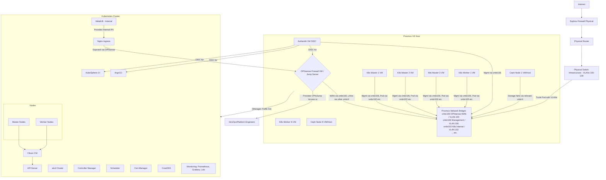
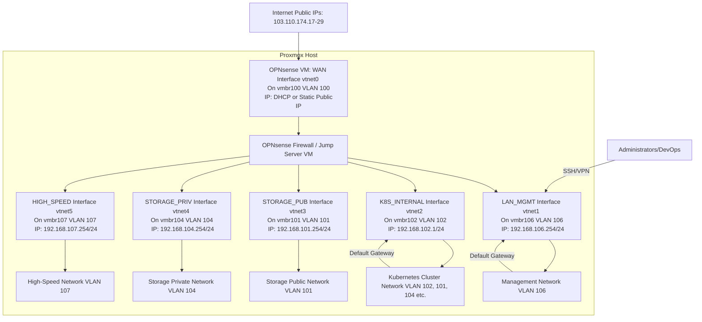
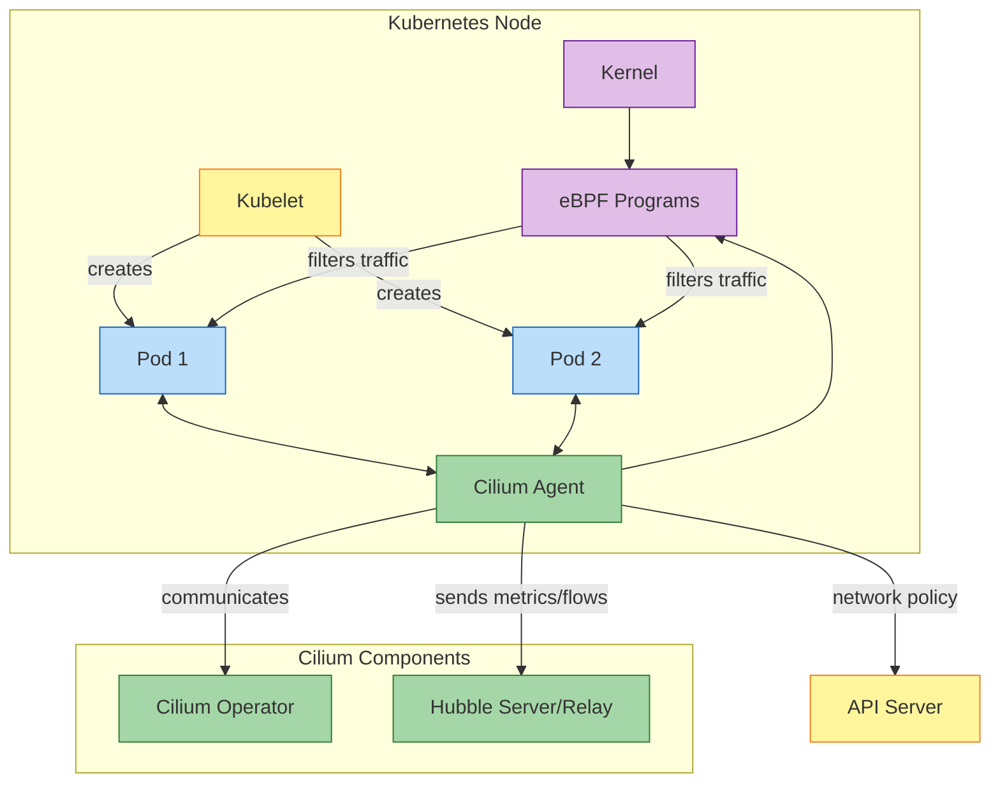

# Comprehensive Kubernetes Infrastructure and Network Deployment Plan (Stages 1-4)

## Table of Contents

## 1. Introduction and Architecture Overview

### 1.1. Goals and Objectives

This document outlines the comprehensive plan for deploying and managing a resilient, scalable, and secure Kubernetes infrastructure on Proxmox VE. The key objectives are:

- **Automation:** Automate the provisioning and configuration of the Proxmox hosts, networking, core service VMs (Firewall, Authentication), and the Kubernetes cluster itself.
- **Security:** Implement a robust security posture with a dedicated firewall, network segmentation, network policies, OIDC authentication, and continuous monitoring.
- **Scalability:** Design the infrastructure to scale horizontally to accommodate growing workloads.
- **High Availability:** Ensure high availability for the control plane, applications, and critical network services.
- **Observability:** Establish comprehensive monitoring, logging, and tracing for the entire stack.
- **GitOps:** Manage all infrastructure and application configurations through GitOps principles.
- **Isolation:** Ensure the Kubernetes networking infrastructure is logically separated and does not interfere with other existing workloads on Proxmox.


### 1.2. Overall Architecture Diagram



### 1.3. Technology Stack

- **Virtualization:** Proxmox VE
- **Infrastructure as Code (IaC):** Terraform (for Proxmox VM provisioning)
- **Configuration Management:** Ansible (for VM preparation, Proxmox host networking, OPNsense setup)
- **Kubernetes Distribution:** KubeKey (for Kubernetes and KubeSphere deployment)
- **Container Runtime:** Containerd
- **CNI:** Cilium (with eBPF, Hubble, WireGuard)
- **Service Mesh:** (Optional, Istio or Linkerd can be integrated later)
- **Load Balancer (External):** OPNsense (NAT, Port Forwarding, HA with CARP)
- **Load Balancer (Internal K8s):** MetalLB (L2 mode) (BGP mode)
- **Ingress Controller:** Nginx Ingress
- **Certificate Management:** Cert-Manager with Let's Encrypt
- **Firewall/Router/VPN:** OPNsense
- **Authentication:** Authentik (OIDC)
- **Storage:** Ceph (managed by Rook)
- **GitOps:** ArgoCD
- **Monitoring:** Prometheus, Grafana, Alertmanager
- **Logging:** Loki, Promtail
- **Tracing:** Tempo (optional, for application-level tracing)
- **Nested Virtualization (Optional):** Kube-OVN, VyOS (if extensive nested clusters are needed)

## 2. Physical Network and Proxmox Host Configuration

### 2.1. Existing Physical Switch Configuration (Reference)

The physical network switches have been pre-configured by the network administration team. The configuration includes the necessary VLANs, trunk ports, and inter-VLAN routing policies at the switch/firewall level. This plan focuses on automating the configuration _from the Proxmox host upwards_.

**Key VLANs (as per provided information):**

| **VLAN ID** | **Purpose**         | **IP Range**       | **Gateway**     | **Internet Access** | **Notes**                                            |
| ----------- | ------------------- | ------------------ | --------------- | ------------------- | ---------------------------------------------------- |
| 100         | Public Traffic      | `192.168.100.0/24` | `192.168.100.1` | Yes                 | External access, API endpoints, OPNsense WAN         |
| 101         | Storage Public      | `192.168.101.0/24` | `192.168.101.1` | Yes                 | Ceph public network                                  |
| 102         | Internal Traffic    | `192.168.102.0/24` | `192.168.102.1` | No                  | Private cluster communication, K8s internal services |
| 104         | Storage Private     | `192.168.104.0/24` | `192.168.104.1` | No                  | Ceph private/replication network                     |
| 105         | Nested Clusters     | `192.168.105.0/24` | `192.168.105.1` | Yes                 | For nested Kubernetes implementations (if used)      |
| 106         | Management          | `192.168.106.0/24` | `192.168.106.1` | No                  | Proxmox host management, Node management, Authentik  |
| 107         | High-Speed External | `192.168.107.0/24` | `192.168.107.1` | Yes                 | Optimized route for specific services (via OPNsense) |
| 108         | Nested Cluster Apps | `192.168.108.0/24` | `192.168.108.1` | Yes                 | Application tier for nested K8s (if used)            |
| 109         | Nested Cluster Data | `192.168.109.0/24` | `192.168.109.1` | No                  | Data tier for nested K8s (if used)                   |

**Switch Port Configuration (Summary from Email):**

- Ports connected to Proxmox hosts (e.g., `1/0/1`, `1/0/3`) are configured as trunk ports allowing all necessary VLANs (100-109).
- Uplink to the main corporate firewall/router is configured.
- Inter-VLAN routing is handled by the corporate firewall, but OPNsense will add another layer of control for traffic entering/leaving the Kubernetes ecosystem.

### 2.2. Automated Proxmox Host Network Configuration

The Proxmox host's network interfaces (`/etc/network/interfaces`) will be configured automatically using Ansible. This ensures consistency and allows for version-controlled network definitions.

#### 2.2.1. Proxmox Host Network Requirements

Each Proxmox host will require:

- A management interface (typically on an untagged VLAN or a dedicated management VLAN, e.g., VLAN 106).
- Linux bridges for each VLAN that VMs will connect to (e.g., `vmbr100`, `vmbr101`, `vmbr106`).
- The physical NIC(s) connected to the trunk ports on the switch will be part of these bridges.

**Example Proxmox Host IP Assignment (Static):**

- `vmbr106` (Management Bridge for VLAN 106): `192.168.106.X/24` (where X is unique per host)
- Other bridges (`vmbr100`, `vmbr101`, etc.) will not have IP addresses on the Proxmox host itself; they will just bridge traffic for VMs. The OPNsense VM and Kubernetes nodes will have IPs on these VLANs.
#### 2.2.2. Ansible for Proxmox Host Networking (Bridge Creation Prerequisite)

An Ansible playbook will manage `/etc/network/interfaces` on each Proxmox host to create the necessary Linux bridges (e.g., `vmbr100`, `vmbr106`, `vmbr102`). **This step is a prerequisite and must be completed before provisioning VMs with Terraform that will attach to these bridges.**

**Ansible Playbook Snippet (`proxmox_networking.yml`):**

```
---
- hosts: proxmox_hosts
  become: true
  vars:
    # Define physical interfaces used for trunking
    # This might vary per host or be a list if bonding is used
    trunk_interface: "eno1" # Example, adjust as per your host
    management_vlan_id: 106
    management_ip_suffix: "{{ ansible_play_hosts.index(inventory_hostname) + 5 }}" # e.g., .5, .6, ...
    management_gateway: "192.168.106.1"
    vlans_to_bridge:
      - 100
      - 101
      - 102
      - 104
      - 105
      # - 106 # Management VLAN bridge is handled separately if it needs an IP on the host
      - 107
      - 108
      - 109

  tasks:
    - name: Ensure networking packages are present
      apt:
        name: ["vlan", "bridge-utils"]
        state: present

    - name: Configure /etc/network/interfaces to create bridges
      template:
        src: templates/interfaces.j2
        dest: /etc/network/interfaces
        owner: root
        group: root
        mode: '0644'
      notify: restart networking

    - name: Ensure networking service is enabled and started (Debian/Ubuntu)
      service:
        name: networking
        state: started
        enabled: yes
      when: ansible_os_family == "Debian"

  handlers:
    - name: restart networking
      service:
        name: networking
        state: restarted
      when: ansible_os_family == "Debian"
```

**Ansible Template (`templates/interfaces.j2`):**

```
# This file is managed by Ansible. Do not edit manually.
auto lo
iface lo inet loopback

# Physical Trunk Interface (e.g., eno1)
auto {{ trunk_interface }}
iface {{ trunk_interface }} inet manual
# For bonding, you would configure bond slaves here and then the bond interface

# Management Bridge (VLAN {{ management_vlan_id }}) with IP on Proxmox Host
auto vmbr{{ management_vlan_id }}
iface vmbr{{ management_vlan_id }} inet static
    address 192.168.{{ management_vlan_id }}.{{ management_ip_suffix }}/24
    gateway {{ management_gateway }}
    bridge-ports {{ trunk_interface }}.{{ management_vlan_id }}
    bridge-stp off
    bridge-fd 0
    # This bridge is for Proxmox host management and can also be used by VMs on this management network.

# --- Bridge Creation for VM Connectivity ---
# The following bridges are primarily for VM network attachments.
# They typically do not have an IP address on the Proxmox host itself,
# unless the host needs to directly communicate on that VLAN for other reasons.

# Main trunk-aware bridge (Optional, if VMs are VLAN-aware themselves)
# auto vmbr0
# iface vmbr0 inet manual
#     bridge-ports {{ trunk_interface }}
#     bridge-stp off
#     bridge-fd 0
#     bridge-vlan-aware yes
#     bridge-vids 2-4094 # Or a more specific list if needed

# Individual Linux Bridges for each VLAN (Simpler for VMs not managing their own VLAN tags)

auto vmbr{{ vlan_id }}
iface vmbr{{ vlan_id }} inet manual
    bridge-ports {{ trunk_interface }}.{{ vlan_id }}
    bridge-stp off
    bridge-fd 0
    # VMs will connect their NICs to this bridge for VLAN {{ vlan_id }} access

```

_The template above creates individual bridges (`vmbr<VLAN_ID>`) for each specified VLAN. These are the bridges that VMs will connect to. The Proxmox host itself only gets an IP on `vmbr{{ management_vlan_id }}`._

#### 2.2.3. Proxmox Host Network Diagram

```mermaid
graph TD
    subgraph ProxmoxHost1 [Proxmox Host 1]
        PVE_OS[Proxmox VE OS]
        PHY_NIC1[Physical NIC 1]
        
        PVE_OS -- Manages --> PHY_NIC1

        Bridge_MGMT[vmbr106 VLAN 106 192.168.106.5/24 192.168.106.1]
        Bridge_V100[vmbr100 VLAN 100]
        Bridge_V101[vmbr101 VLAN 101]
        Bridge_V102[vmbr102 VLAN 102]
        Bridge_V104[vmbr104 VLAN 104]
        Bridge_V105[vmbr105 VLAN 105]
        Bridge_V107[vmbr107 VLAN 107]
        Bridge_V108[vmbr108 VLAN 108]
        Bridge_V109[vmbr109 VLAN 109]

        PHY_NIC1 -- Tagged Traffic --> VLAN106_IF[eno1.106]
        PHY_NIC1 -- Tagged Traffic --> VLAN100_IF[eno1.100]
        PHY_NIC1 -- Tagged Traffic --> VLAN101_IF[eno1.101]
        PHY_NIC1 -- Tagged Traffic --> VLAN102_IF[eno1.102]
        PHY_NIC1 -- Tagged Traffic --> VLAN104_IF[eno1.104]
        PHY_NIC1 -- Tagged Traffic --> VLAN105_IF[eno1.105]
        PHY_NIC1 -- Tagged Traffic --> VLAN107_IF[eno1.107]
        PHY_NIC1 -- Tagged Traffic --> VLAN108_IF[eno1.108]
        PHY_NIC1 -- Tagged Traffic --> VLAN109_IF[eno1.109]

        VLAN106_IF --> Bridge_MGMT
        VLAN100_IF --> Bridge_V100
        VLAN101_IF --> Bridge_V101
        VLAN102_IF --> Bridge_V102
        VLAN104_IF --> Bridge_V104
        VLAN105_IF --> Bridge_V105
        VLAN107_IF --> Bridge_V107
        VLAN108_IF --> Bridge_V108
        VLAN109_IF --> Bridge_V109
        
        PVE_OS -- Access via --> Bridge_MGMT

        VM1_NIC1[VM1 NIC OPNsense WAN] --> Bridge_V100
        VM1_NIC2[VM1 NIC OPNsense LAN_MGMT] --> Bridge_MGMT
        VM1_NIC3[VM1 NIC OPNsense K8S_INTERNAL] --> Bridge_V102
        VM1_NIC4[VM1 NIC OPNsense STORAGE_PUB] --> Bridge_V101
        VM1_NIC5[VM1 NIC OPNsense STORAGE_PRIV] --> Bridge_V104
        VM1_NIC_HS[VM1 NIC OPNsense HIGH_SPEED] --> Bridge_V107


        K8SNode_VM_NIC1[K8s Node VM NIC Management] --> Bridge_MGMT
        K8SNode_VM_NIC2[K8s Node VM NIC Pod Traffic] --> Bridge_V102
        K8SNode_VM_NIC3[K8s Node VM NIC Ceph Public] --> Bridge_V101
        K8SNode_VM_NIC4[K8s Node VM NIC Ceph Private] --> Bridge_V104

    end
    
    PHY_NIC1 --> PhysicalSwitch[Physical Switch Trunk Port];
    PhysicalSwitch --> VLANsTrunked[VLANs 100-109 Trunked];
```



### 2.3. Network Isolation on Proxmox

The Kubernetes infrastructure network is isolated from other potential VMs on the Proxmox cluster through several mechanisms:

1. **VLAN Tagging:** All Kubernetes-related traffic (management, pod, storage) is segregated into specific VLANs. These VLANs are trunked to the Proxmox hosts.
2. **Dedicated Bridges:** Each VLAN has a corresponding Linux bridge on the Proxmox host (e.g., `vmbr100` for VLAN 100, `vmbr102` for VLAN 102). Kubernetes VMs (including the OPNsense firewall) will have their virtual NICs attached to these specific bridges, which were created as per Section 2.2.2.
3. **Firewall Control:** The OPNsense VM will act as the primary gateway and firewall for the Kubernetes ecosystem. It will control all traffic entering and leaving these dedicated VLANs, as well as inter-VLAN traffic within this ecosystem if not handled by an upstream firewall.
4. **Resource Pools:** Proxmox resource pools can be used to group all Kubernetes-related VMs, further organizing them but not directly providing network isolation beyond what VLANs and firewalls offer.
5. **Physical Separation (Optional):** If extreme isolation is required and hardware permits, dedicated physical NICs on Proxmox hosts could be used exclusively for the Kubernetes infrastructure VLANs, separate from NICs used for other general Proxmox VM traffic. However, VLANs on shared NICs are generally sufficient.

This setup ensures that traffic from other VMs on the Proxmox host, if they are not explicitly placed on these Kubernetes VLANs, will not interfere with or have unauthorized access to the Kubernetes network segments.

## 3. Core Infrastructure VM Deployment and Configuration

This section details the automated deployment of essential VMs: the OPNsense Firewall/Jump Server and the Authentik OIDC server.

### 3.1. OPNsense Firewall & Jump Server VM

A dedicated OPNsense VM will serve as the main firewall, router, VPN gateway, and jump server for the Kubernetes infrastructure. It will manage all ingress and egress traffic.

#### 3.1.1. Terraform for OPNsense VM Provisioning (Referencing Pre-created Bridges)

The `k8s-deployment-plan.md` already includes Terraform for Proxmox. We will extend this to provision the OPNsense VM. **Note:** The `bridge` parameters (e.g., `vmbr100`, `vmbr106`) in the `network` blocks below refer to the Linux bridges that **must have already been created on the Proxmox host** using the Ansible playbook detailed in Section 2.2.2.

**Add to `terraform/main.tf` (or a new `opnsense_vm.tf`):**

```terraform
resource "proxmox_vm_qemu" "opnsense_firewall" {
  name          = "opnsense-fw"
  target_node   = "your-proxmox-node" # Specify the target Proxmox node
  pool          = proxmox_pool.k8s_pool.pool_id # Assign to the k8s resource pool
  
  clone         = "opnsense-template" # Name of your OPNsense template VM or uploaded image
  full_clone    = true
  os_type       = "other" 

  cores         = 2
  sockets       = 1
  memory        = 4096 
  scsihw        = "virtio-scsi-pci"
  bootdisk      = "scsi0"

  disk {
    type    = "scsi"
    storage = "local-lvm" 
    size    = "32G"       
    iothread = 1
  }
  
  # WAN Interface (VLAN 100 - Public Traffic)
  # Attaches to the pre-created vmbr100 on the Proxmox host
  network {
    model  = "virtio"
    bridge = "vmbr100" 
    tag    = -1        
  }

  # LAN Interface (VLAN 106 - Management Network)
  # Attaches to the pre-created vmbr106 on the Proxmox host
  network {
    model  = "virtio"
    bridge = "vmbr106" 
    tag    = -1
  }

  # K8S Internal Network Interface (VLAN 102)
  # Attaches to the pre-created vmbr102 on the Proxmox host
  network {
    model  = "virtio"
    bridge = "vmbr102"
    tag    = -1
  }

  # Storage Public Network Interface (VLAN 101)
  # Attaches to the pre-created vmbr101 on the Proxmox host
  network {
    model  = "virtio"
    bridge = "vmbr101"
    tag    = -1
  }
  
  # Storage Private Network Interface (VLAN 104)
  # Attaches to the pre-created vmbr104 on the Proxmox host
  network {
    model  = "virtio"
    bridge = "vmbr104"
    tag    = -1
  }

  # High-Speed External Network Interface (VLAN 107) - Optional dedicated path
  # Attaches to the pre-created vmbr107 on the Proxmox host
  network {
    model  = "virtio"
    bridge = "vmbr107"
    tag    = -1
  }
  
  # Add other interfaces for VLAN 105, 108, 109 if OPNsense needs to directly manage them,
  # ensuring corresponding vmbrX bridges are pre-created on the Proxmox host.

  ipconfig0 = "ip=dhcp" # WAN interface, can be static later via OPNsense UI/config
  sshkeys   = <<EOF
  ${file("~/.ssh/id_rsa.pub")}
  EOF

  lifecycle {
    ignore_changes = [
      network, 
    ]
  }

  provisioner "local-exec" {
    command = "ansible-playbook -i '${self.default_ipv4_address},' --private-key ~/.ssh/id_rsa ../ansible/opnsense_configure.yml"
    # This assumes SSH access is available on default_ipv4_address (likely WAN).
    # Consider using a LAN IP for Ansible access after initial console/template setup.
  }
}

output "opnsense_vm_id" {
  value = proxmox_vm_qemu.opnsense_firewall.id
}
```

_Note: OPNsense cloud-init support can be limited. Initial configuration might require manual steps through the console to set up a LAN IP for Ansible access, or using a pre-configured template._

#### 3.1.2. Ansible for Initial OPNsense Configuration

Ansible can be used to perform initial OPNsense setup after the VM is provisioned, provided SSH access is enabled and an interface is configured with an IP. This typically involves:

- Setting hostname, DNS, NTP.
- Configuring interface IP addresses (WAN, LAN, OPTx).
- Setting up basic firewall rules.
- Enabling SSH for jump server access.
- Hardening (disabling password auth for SSH, etc.).
- (Optionally) Restoring a pre-defined `config.xml`.

**Ansible Playbook Snippet (`ansible/opnsense_configure.yml`):**

```ansible
---
- hosts: all # Should target the OPNsense VM IP
  gather_facts: no # OPNsense might not have Python for full fact gathering initially
  become: yes # Most commands will require root or sudo
  vars:
    opnsense_wan_if: "vtnet0" # Default VirtIO NIC names in FreeBSD/OPNsense
    opnsense_lan_if: "vtnet1"
    opnsense_k8s_internal_if: "vtnet2"
    opnsense_storage_pub_if: "vtnet3"
    opnsense_storage_priv_if: "vtnet4"
    opnsense_high_speed_if: "vtnet5"

    opnsense_lan_ip: "192.168.106.254/24" # Example static IP for OPNsense LAN on VLAN 106
    opnsense_k8s_internal_ip: "192.168.102.1/24" # Gateway for K8s internal network
    # Define other interface IPs as needed

  tasks:
    - name: Wait for SSH to be available
      wait_for_connection:
        delay: 10
        timeout: 300

    # OPNsense configuration is typically done via its web UI, API, or config.xml.
    # Ansible modules for OPNsense are limited. Direct shell commands or config file manipulation is common.
    # This is a conceptual placeholder. `community.general.opnsense_plugin` can be explored.

    - name: Ensure SSH is enabled (conceptual)
      shell: "echo 'PermitRootLogin yes' >> /etc/ssh/sshd_config && service sshd restart"
      # In reality, use OPNsense console options or config backup/restore for initial setup.
      # For jump server: ensure user accounts are set up and SSH keys authorized.

    - name: Set basic firewall rule to allow SSH on LAN (conceptual)
      shell: "pfctl -F rules && echo 'pass in quick on {{ opnsense_lan_if }} proto tcp from any to ({{ opnsense_lan_if }}) port 22' > /tmp/rules.conf && pfctl -f /tmp/rules.conf"
      # This is a very basic example and not how OPNsense rules are typically managed.

    - name: Set LAN interface IP (conceptual - requires OPNsense API or console interaction)
      debug:
        msg: "Manual or API-based configuration of OPNsense interfaces is typically required."
        
    # Further tasks would involve:
    # - Assigning interfaces (WAN, LAN, OPT1, OPT2, etc.)
    # - Setting IP addresses for each interface
    # - Configuring DHCP server on LAN/OPT interfaces if needed
    # - Setting up NAT rules (Outbound NAT for LAN/OPT networks)
    # - Creating firewall aliases for networks and ports
    # - Defining firewall rules for ingress and egress traffic
    # - Configuring VPN (e.g., OpenVPN or WireGuard) for remote access
    # - Setting up user accounts for jump server access (integrate with Authentik later)
```

_Managing OPNsense via Ansible can be challenging due to its FreeBSD base and reliance on its own configuration system. Using the `config.xml` backup/restore feature, or tools that interact with its API (like Terraform provider for OPNsense, if mature) is generally recommended for full automation._

#### 3.1.3. Role as Single Ingress/Egress Point

The OPNsense VM will be the sole entry and exit point for all network traffic related to the Kubernetes cluster and its supporting services.

- **Ingress:** All external traffic destined for services within Kubernetes (e.g., web applications, APIs) will first hit the OPNsense VM's WAN interface. OPNsense will use NAT (Port Forwarding) or a reverse proxy feature (like HAProxy plugin) to direct this traffic to the appropriate internal Kubernetes Ingress controllers or LoadBalancer IPs. Public IPs (103.110.174.17-29) will be assigned to the OPNsense WAN or managed through it.
- **Egress:** All outbound traffic originating from Kubernetes pods or internal services will be routed through the OPNsense VM. OPNsense will apply outbound NAT and firewall policies to this traffic. This allows for centralized control, logging, and security inspection of outbound connections.
- **Inter-VLAN Routing:** OPNsense will manage routing between the different VLANs dedicated to the Kubernetes ecosystem (e.g., between VLAN 102 K8s-Internal and VLAN 101 Storage-Public), applying firewall rules as necessary.
- **Jump Server:** SSH access to the OPNsense VM (on its LAN/Management interface) will provide a secure jump point into the infrastructure network for administrative tasks. Access will be controlled by firewall rules and user authentication (ideally via Authentik).

#### 3.1.4. OPNsense Network Placement Diagram



### 3.2. Authentik Integration for OIDC

Authentik will be deployed to provide centralized OpenID Connect (OIDC) and SAML services for authentication and authorization across various components like ArgoCD, KubeSphere, OPNsense (for VPN/UI access), and potentially SSH access via an OIDC-SSH bridge.

#### 3.2.1. Authentik Deployment Strategy

Authentik can be deployed in several ways:

1. **Dedicated VM:** Provision a VM (e.g., using Terraform and Ansible) on the Management VLAN (106). This offers isolation.
2. **Kubernetes Deployment:** Deploy Authentik within the Kubernetes cluster itself (once the cluster is up). This leverages K8s for HA and management but creates a slight dependency (cluster needs to be up for auth to some tools).

Given the desire for robust, early-available authentication, **deploying Authentik as a dedicated VM is recommended for initial setup.**

**Terraform for Authentik VM (Conceptual - add to `main.tf`):**

```terraform
resource "proxmox_vm_qemu" "authentik_server" {
  name          = "authentik-server"
  target_node   = "your-proxmox-node"
  pool          = proxmox_pool.k8s_pool.pool_id
  clone         = "ubuntu-2204-template" # Or other suitable base template
  full_clone    = true
  os_type       = "l26"

  cores         = 2
  memory        = 4096
  scsihw        = "virtio-scsi-pci"
  bootdisk      = "scsi0"

  disk {
    type    = "scsi"
    storage = "local-lvm"
    size    = "32G"
  }

  network {
    model  = "virtio"
    bridge = "vmbr106" # Connect to Management VLAN, ensure vmbr106 is pre-created
    tag    = -1 
  }

  ipconfig0 = "ip=192.168.106.10/24,gw=192.168.106.254" # Static IP, GW is OPNsense LAN
  nameserver = "192.168.106.254" # OPNsense as DNS resolver
  sshkeys   = file("~/.ssh/id_rsa.pub")
  
  # Further provisioning via Ansible to install Docker and Authentik (docker-compose)
}
```

Ansible would then be used to install Docker and deploy Authentik using its official `docker-compose.yml`.

#### 3.2.2. Integration with OPNsense and ArgoCD

- **OPNsense:**
    - **VPN Authentication:** OPNsense (e.g., OpenVPN) can be configured to use RADIUS, and Authentik can act as a RADIUS provider. Alternatively, for OIDC-based VPNs (less common directly in OPNsense, might need an intermediary).
    - **Web UI Authentication:** OPNsense can use LDAP for its Web UI authentication, and Authentik can expose an LDAP outpost.
- **ArgoCD:** ArgoCD natively supports OIDC for SSO. Configure ArgoCD to use Authentik as an OIDC provider. This involves setting up an OIDC client in Authentik and configuring ArgoCD with the client ID, secret, and issuer URL.
- **KubeSphere:** KubeSphere also supports OIDC. Similar to ArgoCD, configure it to use Authentik.
- **SSH** Jump Server **Access:** Tools like `oidc-ssh-bridge` or `Teleport` (which has OIDC support) can be used to integrate SSH access to the jump server (OPNsense) or other internal servers with Authentik.
## 4. Kubernetes Cluster Deployment

This section leverages the `k8s-deployment-plan.md` structure, adapting it to the current network design.

### 4.1. Terraform for Kubernetes Node VM Provisioning

The `main.tf` and `vagrant_config.tpl` from `k8s-deployment-plan.md` are largely applicable. Key adjustments:

- **VM Network Configuration:** Ensure Kubernetes node VMs are connected to the correct Proxmox bridges corresponding to their required VLANs (e.g., Management VLAN 106, K8s Internal/Pod VLAN 102, Storage VLANs 101/104). Each K8s node might have multiple vNICs attached to different bridges (which must be pre-created as per Section 2.2.2).
    - `vmbr106` for management/SSH.
    - `vmbr102` for primary pod CNI traffic.
    - `vmbr101` for Ceph public network.
    - `vmbr104` for Ceph cluster/private network.
- **Terraform `proxmox_vm_qemu` resource for K8s nodes:**
```terraform
    # Example for a K8s master node in main.tf
    resource "proxmox_vm_qemu" "k8s_master_nodes" {
      count         = 3 # Number of master nodes
      name          = "k8s-master-${count.index + 1}"
      target_node   = "your-proxmox-node" # Or use a variable/map for node placement
      pool          = proxmox_pool.k8s_pool.pool_id
      clone         = "k8s-base-template" # A prepared Ubuntu template
      full_clone    = true
      os_type       = "l26"
    
      cores         = 4
      memory        = 8192 
      scsihw        = "virtio-scsi-pci"
      bootdisk      = "scsi0"
      disk {
        type    = "scsi"
        storage = "local-lvm" # Or Ceph RBD via Proxmox
        size    = "50G"
      }
    
      # Management Interface (attaches to pre-created vmbr106)
      network {
        model  = "virtio"
        bridge = "vmbr106" 
        tag    = -1
      }
      # Pod CNI Interface (attaches to pre-created vmbr102)
      network {
        model  = "virtio"
        bridge = "vmbr102" 
        tag    = -1
      }
      # Ceph Public Interface (attaches to pre-created vmbr101)
      network {
        model  = "virtio"
        bridge = "vmbr101" 
        tag    = -1
      }
      # Ceph Private Interface (attaches to pre-created vmbr104)
      network {
        model  = "virtio"
        bridge = "vmbr104" 
        tag    = -1
      }
    
      ipconfig0 = "ip=192.168.106.${10 + count.index + 1}/24,gw=192.168.106.254" # Master Mgmt IPs: .11, .12, .13
      sshkeys = file("~/.ssh/id_rsa.pub")
      # ... other parameters ...
    }
    
    # Similar resource for k8s_worker_nodes
```

- The Vagrant part from `k8s-deployment-plan.md` might be less relevant if Terraform directly provisions and configures VMs with cloud-init and Ansible. If Vagrant is still used for a libvirt-based local dev setup mirroring Proxmox, its network config needs to align. For direct Proxmox deployment, Terraform + Ansible is more direct.

### 4.2. Ansible for Kubernetes Node Preparation

The Ansible playbook `k8s-prepare.yml` from `k8s-deployment-plan.md` is a good starting point. Key additions/modifications:

- **Network Configuration (Netplan):** Ansible should configure Netplan on each K8s node to set static IPs for all its interfaces (Management, Pod CNI, Ceph Public, Ceph Private) on the respective VLANs. **Example Netplan config (`/etc/netplan/01-netcfg.yaml`) managed by Ansible template:**
### For a K8s node (e.g., k8s-master-1)
```
network:
	version: 2
	renderer: networkd
	ethernets:
		ens18: # Corresponds to vNIC on vmbr106 (Management)
		addresses: [192.168.106.11/24] # Static IP
		gateway4: 192.168.106.254 # OPNsense LAN IP
			nameservers:
			addresses: [192.168.106.254] # OPNsense for DNS
        ens19: # Corresponds to vNIC on vmbr102 (Pod CNI)
			addresses: [192.168.102.11/24] # Static IP
			# No gateway, pod routing handled by CNI or static routes if needed
		ens20: # Corresponds to vNIC on vmbr101 (Ceph Public)
			addresses: [192.168.101.11/24] # Static IP
        ens21: # Corresponds to vNIC on vmbr104 (Ceph Private)
			addresses: [192.168.104.11/24] # Static IP
```
- Ensure Ansible inventory (`inventory.yml`) uses the management IPs (VLAN 106) of the K8s nodes.
- The rest of the preparation (kernel modules, sysctl, containerd) remains valid.

### 4.3. KubeKey for Kubernetes and KubeSphere Installation

The KubeKey configuration (`cluster-config.yaml`) needs updates:

- **Host Addresses:** Use the management IPs (VLAN 106) for `address` and `internalAddress`.
- **ControlPlaneEndpoint:** This should be a VIP managed by Keepalived on the master nodes (on VLAN 102 or 106) or an IP load balanced by OPNsense if OPNsense fronts the API server. For internal HA, Keepalived on masters is common.
### cluster-config.yaml snippet

```
spec:
      hosts:
      # Master Nodes - IPs on VLAN 106 (Management)
      - {name: k8s-master-1, address: 192.168.106.11, internalAddress: 192.168.106.11, user: ubuntu, private_key_path: "~/.ssh/id_rsa"}
      - {name: k8s-master-2, address: 192.168.106.12, internalAddress: 192.168.106.12, user: ubuntu, private_key_path: "~/.ssh/id_rsa"}
      - {name: k8s-master-3, address: 192.168.106.13, internalAddress: 192.168.106.13, user: ubuntu, private_key_path: "~/.ssh/id_rsa"}
      # Worker Nodes - IPs on VLAN 106 (Management)
      - {name: k8s-worker-1, address: 192.168.106.21, internalAddress: 192.168.106.21, user: ubuntu, private_key_path: "~/.ssh/id_rsa"}
      # ... more workers
      controlPlaneEndpoint:
        domain: k8s-api.internal.domain.com # Resolvable internally
        address: "192.168.102.10" # VIP on VLAN 102 for K8s API
        port: 6443
      kubernetes:
        version: v1.27.x # Use a recent stable version
        # ...
      network:
        plugin: cilium # Changed from calico to cilium
        kubePodsCIDR: "10.42.0.0/16"  # Example Pod CIDR
        kubeServiceCIDR: "10.43.0.0/16" # Example Service CIDR
        # For Cilium, often no explicit CNI network interface selection is needed here,
        # as Cilium can auto-detect or be configured via Helm values.
        # However, ensure Kubelet uses the correct node IP from VLAN 102.
      # ...
      addons:
      - name: kubesphere
        # ...
 
```
   
- **Network Plugin:** Changed to `cilium`. KubeKey might have specific ways to deploy Cilium or it might be deployed separately after cluster creation. If KubeKey doesn't directly support Cilium well, deploy a minimal CNI with KubeKey (like Flannel) and then migrate to Cilium, or bootstrap without CNI and install Cilium. _Self-correction: It's generally better to install the target CNI (Cilium) from the start if possible._

### 4.4. Control Plane High Availability

- **ETCD:** KubeKey handles clustered etcd on the master nodes.
- **API Server:** A Virtual IP (VIP) address (e.g., `192.168.102.10` on VLAN 102) should be configured for the Kubernetes API server. This VIP can be managed by Keepalived running on all master nodes. Alternatively, OPNsense can load balance traffic to the API servers on their individual IPs if the VIP approach is not used.

**Ansible role for Keepalived on Master Nodes:**

# tasks/main.yml for keepalived role
```ansible
- name: Install Keepalived
  apt:
    name: keepalived
    state: present

- name: Configure Keepalived
  template:
    src: keepalived.conf.j2
    dest: /etc/keepalived/keepalived.conf
  notify: restart keepalived

- name: Configure check_apiserver script
  template:
    src: check_apiserver.sh.j2
    dest: /etc/keepalived/check_apiserver.sh
    mode: '0755'

- name: Ensure Keepalived is enabled and started
  service:
    name: keepalived
    state: started
    enabled: yes
```

**`keepalived.conf.j2`:**
```ansible
global_defs {
   router_id K8S_MASTER_{{ inventory_hostname_short | replace('k8s-master-', '') }}
}

vrrp_script check_apiserver {
    script "/etc/keepalived/check_apiserver.sh"
    interval 3
    weight 50 # Add 50 to priority if OK
    fall 2    # Require 2 failures to fail
    rise 2    # Require 2 successes to rise
}

vrrp_instance VI_K8S_API {
    state MASTERBACKUP
    interface ens19 # Interface on VLAN 102 (K8s Internal)
    virtual_router_id 51 # Must be unique on the network segment
    priority 150100 # Higher for initial master
    advert_int 1
    authentication {
        auth_type PASS
        auth_pass yoursecurevrrppassword
    }
    virtual_ipaddress {
        192.168.102.10/24 dev ens19 # K8s API VIP on VLAN 102
    }
    track_script {
        check_apiserver
    }
}
```


**`check_apiserver.sh.j2`:**
```ansible
#!/bin/sh
errorExit() {
    echo "*** $*" 1>&2
    exit 1
}

curl --silent --max-time 2 --insecure https://localhost:6443/livez -o /dev/null || errorExit "Error GET https://localhost:6443/livez"
if ip addr | grep -q 192.168.102.10; then
    curl --silent --max-time 2 --insecure [https://192.168.102.10:6443/livez](https://192.168.102.10:6443/livez) -o /dev/null || errorExit "Error GET [https://192.168.102.10:6443/livez](https://192.168.102.10:6443/livez)"
fi
```


## 5. Kubernetes Networking Configuration

With the Kubernetes cluster provisioned (as per Stage 4), this section details the configuration of its internal networking components. Many of these will be deployed via ArgoCD as applications.

### 5.1. CNI - Cilium

Cilium is chosen for its advanced networking, security, and observability capabilities, leveraging eBPF.

#### 5.1.1. Cilium Architecture and Deployment Review

The Cilium CNI architecture, as previously discussed in conceptual documents (e.g., `Pn-Infra Networking.md`), involves agents on each node interacting with the Linux kernel via eBPF, managed by an operator.
Deployment is typically via Helm, managed through an ArgoCD application.



#### 5.1.2. Cilium Configuration (eBPF, Hubble, WireGuard)

The `cilium-values.yaml` will be version-controlled in Git and applied by an ArgoCD application.

`cilium-values.yaml` **(Referenced from Stage 4.3, for ArgoCD deployment):**

```yaml
# From Pn-Infra Networking.md (Part 2.1.1) and previous discussions
kubeProxyReplacement: "strict" 
k8sServiceHost: "192.168.102.10"  # K8s API VIP (VLAN 102)
k8sServicePort: 6443

ipam:
  mode: "kubernetes" 
  operator:
    clusterPoolIPv4PodCIDRList: ["10.42.0.0/16"] # Pod CIDR
    clusterPoolIPv4MaskSize: 24 

tunnel: vxlan # Or geneve. Native routing is an option if inter-node L3 routing is fully managed.

hubble:
  enabled: true
  relay:
    enabled: true
  ui:
    enabled: true
  metrics:
    enabled: # As per Pn-Infra Networking.md Part 2.8.1 & 4.3.1
      - dns:query;ignoreAAAA
      - drop:reason
      - tcp:flags
      - flow:verdict;sourceContext:namespace,pod;destinationContext:namespace,pod
      - icmp:type
      - http:method,path,status
  tls: 
    enabled: true
    auto:
      enabled: true
      method: helm 

encryption:
  enabled: true
  type: wireguard # For pod-to-pod traffic encryption

bpf:
  masquerade: true 

identityAllocationMode: crd

operator:
  replicas: 2 

enablePolicy: "default" # Or "always" for stricter default-deny

# Ensure Cilium uses the correct interfaces on multi-homed K8s nodes for pod traffic (VLAN 102 - ens19)
# This might require setting 'devices' if auto-detection isn't sufficient,
# or ensuring Kubelet's primary node IP is on this interface.
# devices: ["ens19"] # Example if ens19 is the dedicated pod network interface on VLAN 102
# nodePort:
#   devices: ["ens19"] # If NodePort services should also primarily use this interface.

# Enable BPF-based host routing if your kernel supports it for performance.
# autoDirectNodeRoutes: true # As per Pn-Infra Networking.md Part 2.1.1
```

This configuration would be part of an ArgoCD `Application` manifest pointing to the Cilium Helm chart.

### 5.2. Pod and Service CIDRs Review

- Pod CIDR: `10.42.0.0/16` (as defined in KubeKey/Cilium config). Each node gets a `/24` from this range.
- Service CIDR: `10.43.0.0/16` (as defined in KubeKey config for ClusterIPs).

(Relevant diagram from `Pn-Infra Networking.md` Part 2.2)

### 5.3. VLAN Assignment for Kubernetes Nodes Review

As established in Stage 4.1 and 4.2:

- **Management Interface (e.g., `ens18`)**: VLAN 106 (`192.168.106.0/24`) - For SSH, Ansible, Kubelet registration if primary IP.
- **Pod CNI Traffic Interface (e.g., `ens19`)**: VLAN 102 (`192.168.102.0/24`) - Kubelet node IP should be on this interface for Cilium's default operation. Cilium pods will primarily use this for inter-node communication.
- **Ceph Public Interface (e.g., `ens20`)**: VLAN 101 (`192.168.101.0/24`).
- **Ceph Private Interface (e.g., `ens21`)**: VLAN 104 (`192.168.104.0/24`).

(Relevant diagram from `Pn-Infra Networking.md` Part 2.3, adapted for actual VLANs)

### 5.4. Load Balancing with MetalLB (Internal - L2 Mode)

MetalLB provides `LoadBalancer` type services for exposing applications internally within your cluster's network segments, or for providing stable internal endpoints that OPNsense can NAT public traffic to.

**Mode Selection**: MetalLB will be configured in `L2 mode`. This mode uses standard network protocols like ARP (for IPv4) to make services reachable on the local network. One node will announce the service IP, with failover to another node if the primary announcer becomes unavailable.

**MetalLB Configuration (via ArgoCD Application pointing to MetalLB Helm chart or manifests):**

**1. `IPAddressPool` CRD:**

This defines the range of IPs MetalLB can assign to services.

```yaml
# metallb-ipaddresspool.yaml
apiVersion: metallb.io/v1beta1
kind: IPAddressPool
metadata:
  name: k8s-internal-services-pool
  namespace: metallb-system
spec:
  addresses:
  - 192.168.102.200-192.168.102.250 # Range on K8s Internal VLAN (VLAN 102)
  # Ensure this range is reserved and not used by DHCP or other static assignments.
```

**2. `L2Advertisement` CRD:**

This tells MetalLB to announce service IPs from the specified pool(s) using L2 mechanisms (ARP/NDP) on the appropriate network interfaces.

```yaml
# metallb-l2advertisement.yaml
apiVersion: metallb.io/v1beta1
kind: L2Advertisement
metadata:
  name: k8s-internal-services-l2
  namespace: metallb-system
spec:
  ipAddressPools:
  - k8s-internal-services-pool
  # Optional: nodeSelectors to restrict which nodes can announce L2 IPs.
  # By default, all nodes capable will participate.
  # nodeSelectors:
  # - matchLabels:
  #     role: metallb-speaker
  # Optional: interfaces to restrict which network interfaces are used for L2 announcements.
  # This is useful on multi-homed nodes to ensure announcements go out on the correct L2 segment.
  # interfaces: 
  # - "ens19" # Example: K8s node interface connected to VLAN 102
```

These CRDs would be deployed via ArgoCD after MetalLB itself is installed. The `k8s-deployment-plan.md` referenced deploying MetalLB via its Helm chart, which is a good approach. These CRDs would then be applied as separate manifests or as part of the Helm values if the chart supports embedding them.

### 5.5. Ingress Controller - Nginx

The Nginx Ingress controller handles L7 load balancing for HTTP/S traffic.
(Nginx Ingress deployment via ArgoCD from `k8s-deployment-plan.md` is relevant).

**Key Configuration Points:**

- The Nginx Ingress controller's service will be of type `LoadBalancer`.
- MetalLB (in L2 mode) will assign it an IP from the `192.168.102.200-192.168.102.250` pool (e.g., `192.168.102.200`).
- OPNsense will be configured with Port Forwarding rules to direct traffic from a public IP (e.g., `103.110.174.17` on ports 80/443) to this internal Nginx Ingress IP (`192.168.102.200` ports 80/443).

**Values for Nginx Ingress Helm chart (via ArgoCD):**

```yaml
# nginx-ingress-values.yaml
controller:
  replicaCount: 2 # For HA
  service:
    type: LoadBalancer
    # loadBalancerIP: "192.168.102.200" # Optionally request a specific IP if MetalLB supports it and it's free
    annotations:
      metallb.universe.tf/address-pool: k8s-internal-services-pool # Ensure it uses the correct pool
  # Enable ModSecurity/WAF as per Pn-Infra Networking.md Part 3.2.2 if desired
  # enableModsecurity: true
  # enableOwaspCoreRules: true
  admissionWebhooks:
    patch:
      nodeSelector:
        kubernetes.io/os: linux 
```

### 5.6. Certificate Management - Cert Manager

Cert-Manager automates the management and issuance of TLS certificates.
(Cert-Manager deployment via ArgoCD from `k8s-deployment-plan.md` is relevant).

**ClusterIssuer Example (from Stage 4.4 of the previous document, to be deployed via ArgoCD):**

```yaml
# cert-manager-clusterissuer.yaml
apiVersion: cert-manager.io/v1
kind: ClusterIssuer
metadata:
  name: letsencrypt-prod
spec:
  acme:
    server: https://acme-v02.api.letsencrypt.org/directory
    email: your-admin-email@example.com # REPLACE THIS
    privateKeySecretRef:
      name: letsencrypt-prod-key
    solvers:
    - http01:
        ingress:
          class: nginx # Matches your Nginx Ingress controller class
          # Ensure OPNsense allows HTTP traffic on port 80 from Let's Encrypt validation servers
          # to the Nginx Ingress Controller's public-facing IP.
```

Ingress resources will then reference this ClusterIssuer to obtain certificates.

### 5.7. Network Policies with Cilium

Network policies are crucial for microsegmentation and security within the cluster.
(Content from `Pn-Infra Networking.md` Part 2.4, 3.2.1 is relevant).

**Strategy:**

1. **Default Deny**: Implement a cluster-wide or per-namespace default deny policy.

```yaml
# default-deny-all-clusterwide.yaml
apiVersion: "cilium.io/v2"
kind: CiliumClusterwideNetworkPolicy
metadata:
  name: "default-deny-all"
spec:
  description: "Deny all traffic by default cluster-wide unless explicitly allowed."
  endpointSelector: {} # Selects all pods in the cluster
  ingress: []
  egress: []
```

2. **Essential Services Allowances**:

- Allow DNS queries to CoreDNS (kube-system namespace) from all pods.

```yaml
# allow-dns-clusterwide.yaml
apiVersion: "cilium.io/v2"
kind: CiliumClusterwideNetworkPolicy
metadata:
  name: "allow-dns-to-kubedns"
spec:
  endpointSelector: {} # All pods
  egress:
  - toEndpoints:
    - matchLabels:
        "k8s:io.kubernetes.pod.namespace": kube-system
        "k8s:k8s-app": kube-dns
    toPorts:
    - ports:
      - port: "53"
        protocol: UDP
      - port: "53"
        protocol: TCP
  # Also allow egress to OPNsense if it acts as an upstream resolver for CoreDNS
  - toCIDRSet:
    - cidr: 192.168.106.254/32 # OPNsense LAN/Management IP
    # Or if OPNsense is providing DNS on K8s internal net:
    # - cidr: 192.168.102.1/32 # OPNsense K8s Internal IP
    toPorts:
    - ports:
      - port: "53"
        protocol: UDP
      - port: "53"
        protocol: TCP
```

- Allow kubelet health checks.
- Allow traffic to the Kubernetes API server.

3. **Application-Specific Policies**: Define policies based on application tiers (frontend, backend, database) or service labels.

(Example from `Pn-Infra Networking.md` Part 2.4.2 for tier isolation is a good model).

All network policies will be defined as YAML and managed via GitOps (ArgoCD).

### 5.8. Ceph Storage Networking

Ceph provides distributed storage for Kubernetes Persistent Volumes, managed by Rook.
(Content from `Pn-Infra Networking.md` Part 2.4.2 is relevant).

- Public Network (for client access, MONs, MGRs, RGW, MDS): VLAN 101 (`192.168.101.0/24`). Kubernetes nodes/pods will use this network to connect to Ceph services.
- Cluster Network (for OSD replication, heartbeats): VLAN 104 (`192.168.104.0/24`). This should be isolated and high-speed if possible.

**Rook `CephCluster` CRD (`rook-ceph-cluster.yaml` for ArgoCD):**

```yaml
# Adapted from Pn-Infra Networking.md Part 2.5.1
apiVersion: ceph.rook.io/v1
kind: CephCluster
metadata:
  name: rook-ceph
  namespace: rook-ceph # Ensure this namespace is created by ArgoCD or pre-exists
spec:
  cephVersion:
    image: quay.io/ceph/ceph:v18.2.x # Specify a recent stable Ceph version (e.g., Reef)
    allowUnsupported: false
  dataDirHostPath: /var/lib/rook # Ensure this path is available and writable on K8s nodes
  mon:
    count: 3 # Minimum for HA
    allowMultiplePerNode: false # Recommended for production on different physical hosts if possible
  dashboard:
    enabled: true
    ssl: true # Recommended
  network:
    # Rook will try to use these CIDRs to select appropriate interfaces on nodes.
    # K8s nodes must have interfaces configured in these subnets (VLAN 101 and 104).
    publicNetwork: "192.168.101.0/24"
    clusterNetwork: "192.168.104.0/24"
    # provider: host # If using hostNetwork for Ceph pods.
    # connections: # For more explicit interface binding if needed with host networking
    #   public:
    #     networkInterface: ens20 # Example interface name on K8s nodes for VLAN 101
    #   cluster:
    #     networkInterface: ens21 # Example interface name on K8s nodes for VLAN 104
  storage: # Configure based on your available devices on K8s worker nodes
    useAllNodes: false # Be specific with nodes for storage
    nodes:
      - name: "k8s-worker-1" # Match node name
        devices:
          - name: "sdb" # Example device, ensure it's dedicated to Ceph
          # - name: "sdc"
        # Or use deviceFilter:
        # deviceFilter: "^sd[b-z]$"
      - name: "k8s-worker-2"
        devices:
          - name: "sdb"
      - name: "k8s-worker-3"
        devices:
          - name: "sdb"
    # useAllDevices: false 
    # deviceFilter: "" # Use if you want to filter devices by name
  # Annotations on nodes can help Rook select correct interfaces if auto-detection is tricky:
  # rook.io/operatorNamespace: <namespace of operator>
  # ceph.rook.io/publicNetworkInterface: <iface for publicNetwork>
  # ceph.rook.io/clusterNetworkInterface: <iface for clusterNetwork>
  healthCheck:
    daemonHealth:
      mon:
        interval: 45s
        timeout: 600s
      osd:
        interval: 45s
        timeout: 600s
      status:
        interval: 60s
```

Storage Classes (CephBlockPool, CephFilesystem, CephObjectStore) will be defined separately to provision storage from this Ceph cluster.

### 5.9. Nested Cluster Networking (Kube-OVN & VyOS - Optional)

This is an advanced feature and will only be implemented if there's a specific requirement for running fully isolated Kubernetes clusters inside the primary Kubernetes cluster pods.
(Content from `Pn-Infra Networking.md` Part 2.6 is relevant).

If required:

- **VLANs**: 105 (Nested DMZ), 108 (Nested Apps), 109 (Nested Data) would be plumbed to OPNsense or a dedicated router VM (like VyOS).
- **Kube-OVN**: Would be used as the CNI within the "host" Kubernetes cluster to provide networking for these nested K8s environments (pods that are themselves K8s clusters).
- **Routing**: OPNsense (or VyOS VM) would handle routing for these nested cluster VLANs.

This adds significant complexity and is generally for specialized use cases.

### 5.10. DNS and Service Discovery (CoreDNS)

CoreDNS is the default DNS server in Kubernetes, installed by KubeKey.
(Content from `Pn-Infra Networking.md` Part 2.7 is relevant).

**Configuration (`coredns` ConfigMap in `kube-system`):**

- **Internal Resolution**: Handles *.cluster.local, *.svc.cluster.local, etc.
- **Upstream Forwarding**: For external domains, CoreDNS should forward queries. This should ideally be to your OPNsense VM if it's configured as a DNS resolver/forwarder for your internal networks, or directly to trusted public DNS servers.

**Custom CoreDNS Configuration (managed via ArgoCD, patching the default ConfigMap or using `coredns-custom`):**

```yaml
# From Pn-Infra Networking.md Part 2.7.1, adjusted
apiVersion: v1
kind: ConfigMap
metadata:
  name: coredns-custom # This might be merged into the main coredns ConfigMap
  namespace: kube-system
data:
  Corefile.override: | # Or the specific key KubeKey/your K8s version uses for customization
    .:53 {
        errors
        health {
            lameduck 5s
        }
        ready
        kubernetes cluster.local in-addr.arpa ip6.arpa {
            pods insecure
            fallthrough in-addr.arpa ip6.arpa
            ttl 30
        }
        prometheus :9153
        forward . 192.168.106.254 # OPNsense LAN IP (if it's a DNS forwarder)
        # Alternative if OPNsense provides DNS on the K8s internal network:
        # forward . 192.168.102.1 
        # Fallback to public DNS if OPNsense is unreachable or for resilience:
        # forward . 8.8.8.8 8.8.4.4
        cache 30
        loop
        reload
        loadbalance
    }
    # Custom DNS zone for specific internal domains if needed, e.g., for nested clusters
    # nested.mycorp.local:53 {
    #    errors
    #    cache 30
    #    forward . 192.168.105.1 # Gateway/DNS for nested cluster VLAN 105
    # }
```

## 6. Advanced Network Security and Routing via OPNsense

The OPNsense VM is central to the security and routing strategy for the Kubernetes ecosystem. All configurations here are performed on the OPNsense VM, ideally managed via its config.xml (backed up to Git) or API if automation tools are used.
 
### 6.1. OPNsense Firewall Rule Design

A meticulous firewall rule set is paramount. The general principle is **default deny**, with explicit allow rules for legitimate traffic.

**Key Rule Categories**:

1. **WAN** Interface (e.g., `vtnet0` on VLAN 100):
    - **Default Deny Inbound**: Block all unsolicited inbound traffic.
    - **Allow ICMP (Optional but Recommended)**: Allow ICMP echo requests for connectivity testing (rate-limit if possible).
    - **Port Forwarding (NAT) for Kubernetes Services**: For each public IP and port combination needed for an external service (e.g., 103.110.174.17:443 for HTTPS): Create a NAT Port Forward rule to translate the destination to the Nginx Ingress controller's internal IP (e.g., 192.168.102.200:443) assigned by MetalLB on VLAN 102. Ensure the associated filter rule is automatically created or manually add a WAN interface rule to pass this specific forwarded traffic. Example: Pass TCP Any -> WAN Address:443 (NAT to 192.168.102.200:443)
    - **VPN Access**: Allow specific VPN protocols (e.g., OpenVPN UDP/1194, WireGuard UDP/51820) from any to the WAN IP if OPNsense hosts the VPN server.
    - **Management Access (Highly Restricted)**: If OPNsense WebUI or SSH needs to be accessible from specific external static IPs, create very strict rules. Prefer VPN access.

2. **LAN/Management Interface** (e.g., vtnet1 on VLAN 106 - 192.168.106.0/24):
    - **Allow Management Access to OPNsense**: Allow HTTPS (for WebUI) and SSH from trusted internal management subnets/hosts to the OPNsense IP on this interface (192.168.106.254).
    - **Allow DNS Queries**: Allow devices on this VLAN to query OPNsense for DNS (if Unbound/Dnsmasq is enabled).
    - **Allow NTP Queries**: Allow devices to query OPNsense for NTP (if NTP server is enabled).
    - **Outbound to Internet (Controlled)**: Define rules for what devices on the management VLAN can access externally (e.g., Proxmox hosts for updates, Authentik VM for external identity providers). This traffic will be NATed by OPNsense on its WAN interface.
    - **Inter-VLAN Access (Restricted)**: Deny by default. Explicitly allow traffic from this management VLAN to specific ports/hosts on other internal K8s VLANs if absolutely necessary (e.g., accessing K8s API VIP).

3. **K8S_INTERNAL Interface** (e.g., vtnet2 on VLAN 102 - 192.168.102.0/24):
    - **Allow Outbound to WAN (NATed)**: Allow traffic from the K8s pod CIDR (10.42.0.0/16) and K8s node IPs on VLAN 102 (192.168.102.0/24) to any on the WAN interface. Outbound NAT should be configured for these sources on OPNsense. Consider FQDN alias-based rules for allowing egress to specific external services (e.g., container registries, external APIs) for better security.
    - **Allow DNS Queries**: Allow this network to query OPNsense for DNS.
    - **Allow NTP Queries**: Allow this network to query OPNsense for NTP.
    - **Allow Access to Storage Public Network (VLAN 101)**: Allow traffic from 192.168.102.0/24 and 10.42.0.0/16 to Ceph service IPs/ports on VLAN 101 (192.168.101.0/24).
    - **Deny by Default to Other Internal Segments**: Explicitly block traffic to more sensitive segments like Management (VLAN 106) or Ceph Private (VLAN 104) unless specifically required and justified.

4. **STORAGE_PUB Interface** (e.g., vtnet3 on VLAN 101 - 192.168.101.0/24):
    - **Allow Access from K8S_INTERNAL**: Allow necessary Ceph client ports from VLAN 102.
    - **Outbound to WAN (Controlled)**: If Ceph components need direct internet access (e.g., for telemetry, updates, though often proxied), allow specific traffic, NATed by OPNsense.
    - **Deny by Default to Other Segments**.

5. **STORAGE_PRIV Interface** (e.g., vtnet4 on VLAN 104 - 192.168.104.0/24):
    - **Strictly Internal**: This network should generally not have direct internet access or access to other non-storage related VLANs.
    - **Allow traffic only between Ceph nodes on this VLAN for replication and heartbeats**. OPNsense rules here would be to block any unintended traffic trying to route out of this segment.

6. **HIGH_SPEED Interface** (e.g., vtnet5 on VLAN 107 - 192.168.107.0/24):
    - **Define rules based on the specific purpose of this network**. If it's for specific applications needing optimized outbound, allow that traffic, NATed by OPNsense.

**General Rules**:
- **Logging**: Enable logging on important pass and all block/reject rules for troubleshooting and security analysis.
- **Aliases**: Extensively use Aliases for IPs, networks, and ports to make rules more readable and maintainable.
- **Rule Order**: Pay close attention to rule order, as OPNsense processes rules from top to bottom, first match wins.

### 6.2. Advanced Routing with OPNsense (Policy-Based Routing)

With MetalLB in L2 mode, OPNsense doesn't need BGP to learn routes to internal LoadBalancer service IPs; these IPs will be directly accessible on the L2 segment (VLAN 102) where MetalLB announces them via ARP. OPNsense, being the gateway for VLAN 102, will naturally be able to route to them.

However, Policy-Based Routing (PBR) on OPNsense remains useful for other scenarios:

- **Gateways**: Ensure all necessary gateways (e.g., default WAN gateway, any alternative WANs if you have them) are defined under System -> Gateways.
- **Rules for PBR**: Firewall rules (Firewall -> Rules -> [Interface]) can be configured with a "Gateway" option to override the default routing table lookup.

**Example**: To route all traffic from a specific internal source IP (e.g., a pod on VLAN 102 that needs a special outbound path via a hypothetical WAN2 gateway configured on OPNsense):
- Interface: K8S_INTERNAL (vtnet2)
- Protocol: Any
- Source: IP_of_Specific_Pod_or_Service
- Destination: Any
- Gateway: WAN2_GW (select the alternative gateway)

**Example for VLAN 107 (High-Speed External)**: Create a rule on the HIGH_SPEED interface (vtnet5) allowing outbound traffic and set its gateway to the primary WAN, potentially with higher priority traffic shaping. This ensures traffic originating from or destined to this network takes a specific path if needed.

Static routes might also be configured on OPNsense (System -> Routes -> Configuration) if there are other internal networks beyond the directly connected VLANs that need to be reached and are not learned via dynamic routing.

### 6.3. Traffic Shaping and QoS on OPNsense

OPNsense provides robust traffic shaping capabilities using Pipes, Queues, and Rules.

- **Pipes** (Firewall -> Shaper -> Pipes): Define the maximum bandwidth available. Create an upload pipe and a download pipe for your WAN connection(s).
- **Queues** (Firewall -> Shaper -> Queues): Define how bandwidth within a pipe is distributed. Use schedulers like FQ_CODEL (Fair Queueing with Controlled Delay) for good general performance. Create child queues under pipes for different traffic priorities (e.g., High_Priority_K8S, Default_K8S, Low_Priority_Bulk). Assign weights or bandwidth percentages to these queues.
- **Rules** (Firewall -> Shaper -> Rules): Assign traffic to specific queues. Create rules matching traffic (e.g., by source/destination IP, port, DSCP value) and assign it to a queue.

**Example**:
- Traffic to/from K8s API server IP (192.168.102.10) on port 6443 could be assigned to a high-priority queue.
- Traffic from known backup services within K8s could be assigned to a low-priority queue.
- If Cilium is configured to apply DSCP markings to pod egress traffic, OPNsense shaper rules can match on these DSCP values to enforce QoS policies centrally.

### 6.4. Intrusion Detection/Prevention (Suricata on OPNsense)

OPNsense integrates Suricata for robust IDS/IPS.

- **Installation** (Services -> Intrusion Detection -> Administration -> Install Suricata): Install if not already present.
- **Global Settings**:
  - Enable IDS.
  - Mode: Start with IDS (Passive Monitoring) to avoid inadvertently blocking legitimate traffic. Once you are confident with the rules and have tuned false positives, you can consider IPS (Inline Packet Filtering) on specific interfaces/rules.
  - Promiscuous mode: Typically off for a firewall VM.
  - Pattern matcher algorithm: e.g., Hyperscan (if available and CPU supports it).
- **Interfaces** (Services -> Intrusion Detection -> Administration -> Interfaces): Assign interfaces for Suricata to monitor (e.g., WAN, K8S_INTERNAL - VLAN 102, MANAGEMENT - VLAN 106). Enable IPS mode per interface if you decide to use it.
- **Rule Sets** (Services -> Intrusion Detection -> Administration -> Rules / Download): Enable and download reputable rule sets (e.g., ET Open is free; Snort VRT requires subscription). Schedule automatic updates for rule sets (e.g., daily).
- **Policies** (Services -> Intrusion Detection -> Administration -> Policies): Define policies to select which categories of rules from your downloaded sets are active. Start with a balanced policy (e.g., one that prioritizes known exploits and malware C&C) and tune based on alerts and your environment's specific risk profile.
- **Alerts** (Services -> Intrusion Detection -> Alerts): Monitor alerts generated by Suricata.
- **Logging**: Ensure Suricata logs are sent to OPNsense system logs and subsequently to Loki/Promtail (see Stage 7.4). The eve.json log format is rich and useful for SIEM integration.
- **Tuning**: IDS/IPS requires ongoing tuning. Regularly review alerts to identify false positives and suppress or modify problematic rules. Understand the impact of rules before enabling them in blocking (IPS) mode.

## 7. Network Observability and Monitoring

Building on the foundations from Pn-Infra Networking.md (Parts 2.8 and 4).

### 7.1. Observability Stack Architecture

```mermaid
graph TD
    subgraph "Data Collection Layer"
        PROM[Prometheus Scrapers]
        LOKI_PROMTAIL[Loki & Promtail Agents]
        HUBBLE_AGENTS[Hubble Agents/Relay]
        TEMPO_COLLECT["Tempo Collectors/Distributors (Optional)"]
    end
    
    subgraph "Storage & Processing Layer"
        PROM_TSDB[Prometheus TSDB]
        LOKI_STORAGE["Loki Storage (Chunks/Index)"]
        HUBBLE_RELAY_STORE["Hubble Relay (Flow Buffer)"]
        TEMPO_STORAGE["Tempo Storage (Traces - Optional)"]
        ALERTMANAGER[Alertmanager]
    end
    
    subgraph "Querying & Visualization Layer"
        GRAFANA[Grafana]
        HUBBLE_UI[Hubble UI]
        PROM_API[Prometheus API]
        LOKI_API[Loki API]
        TEMPO_API["Tempo API (Optional)"]
    end

    subgraph "Network Components Monitored"
        K8S_API[Kubernetes API Server]
        COREDNS[CoreDNS]
        CILIUM_AGENTS_OPERATOR[Cilium Agents & Operator]
        METALLB_SPEAKERS_CONTROLLER[MetalLB Controller & Speakers]
        NGINX_INGRESS[Nginx Ingress Controller]
        OPNSENSE_FW["OPNsense Firewall (System, Firewall, Suricata)"]
        CEPH_CLUSTER["Ceph Cluster (Rook)"]
        K8S_NODES["Kubernetes Nodes (Network Interfaces)"]
    end

    K8S_API --Metrics--> PROM; COREDNS --Metrics--> PROM; CILIUM_AGENTS_OPERATOR --Metrics--> PROM;
    METALLB_SPEAKERS_CONTROLLER --Metrics--> PROM; NGINX_INGRESS --Metrics--> PROM;
    OPNSENSE_FW --Syslog/Exporter--> LOKI_PROMTAIL; OPNSENSE_FW --Exporter/SNMP--> PROM;
    CEPH_CLUSTER --Metrics--> PROM; K8S_NODES --NodeExporter Metrics--> PROM;

    CILIUM_AGENTS_OPERATOR --Flows--> HUBBLE_AGENTS; HUBBLE_AGENTS --Flows--> HUBBLE_RELAY_STORE;
    
    K8S_NODES --Logs--> LOKI_PROMTAIL; CILIUM_AGENTS_OPERATOR --Logs--> LOKI_PROMTAIL;
    METALLB_SPEAKERS_CONTROLLER --Logs--> LOKI_PROMTAIL; NGINX_INGRESS --Logs--> LOKI_PROMTAIL;
    COREDNS --Logs--> LOKI_PROMTAIL; CEPH_CLUSTER --Logs--> LOKI_PROMTAIL;

    PROM --Stores--> PROM_TSDB; LOKI_PROMTAIL --Stores--> LOKI_STORAGE;
    PROM_TSDB --Alert Rules--> ALERTMANAGER;
    
    GRAFANA --Queries--> PROM_API; GRAFANA --Queries--> LOKI_API; GRAFANA --Queries--> TEMPO_API;
    HUBBLE_UI --Queries--> HUBBLE_RELAY_STORE;
    
    Users[Users/Admins] --> GRAFANA; Users --> HUBBLE_UI; Users --> ALERTMANAGER;
```



### 7.2. Prometheus Configuration for Network Components

(Helm chart values from `Pn-Infra Networking.md` Part 4.2.1, `ServiceMonitors` from Part 4.2.2 are relevant).

Ensure Prometheus is configured to scrape:

- **Cilium Agents & Operator**: Metrics endpoint exposed by Cilium pods.
- **Hubble Relay/Server**: Metrics endpoint.
- **MetalLB Controller & Speakers**: Metrics endpoint.
- **Nginx Ingress Controller**: Metrics endpoint.
- **CoreDNS**: Metrics endpoint.
- **OPNsense**:
  - Use the node_exporter if installed on OPNsense (requires manual installation or community plugin like os-node_exporter).
  - Use an SNMP exporter if OPNsense SNMP is configured (System -> Settings -> SNMP).
  - Suricata can be configured to output stats that might be scraped or converted to Prometheus format.

```yaml
# prometheus-additional-scrape-configs.yaml (example for OPNsense)
- job_name: 'opnsense-system' # Assuming node_exporter on OPNsense
  static_configs:
    - targets: ['192.168.106.254:9100'] # OPNsense LAN IP
# - job_name: 'opnsense-snmp' # If using SNMP Exporter
#   static_configs:
#     - targets: ['192.168.106.254'] # OPNsense LAN IP for SNMP
#   metrics_path: /snmp
#   params:
#     module: ['opnsense_ifmib'] # Example SNMP module
#   relabel_configs:
#     - source_labels: [__address__]
#       target_label: __param_target
#     - source_labels: [__param_target]
#       target_label: instance
#     - target_label: __address__
#       replacement: <snmp-exporter-address>:9116 # Address of your SNMP exporter
```

- **Kubernetes API Server & Kubelet**: Standard scrape configs usually included with Prometheus Operator.

### 7.3. Hubble for Network Flow Monitoring

Cilium configuration (Section 5.1.2) already enables Hubble.

- **Access Hubble UI**: Expose the Hubble UI service (e.g., via kubectl port-forward or an Ingress secured by OPNsense/Authentik).
- **Hubble CLI**: Use cilium hubble observe for real-time flow analysis from nodes.
- **Grafana Dashboard for Flows**: (Example from Pn-Infra Networking.md Part 4.3.2) - Use Hubble's metrics (e.g., hubble_flows_processed_total, hubble_drop_total, hubble_tcp_flags_total, hubble_policy_verdicts_total) to build dashboards showing traffic patterns, drops, and policy verdicts. Filter by source/destination namespace, pod, IP, DNS queries, and HTTP paths.

### 7.4. Log Collection and Analysis (Loki & Promtail) for Network Events

(Loki/Promtail configs from `Pn-Infra Networking.md` Part 4.4 are relevant).

- **Promtail DaemonSet**: Collects logs from all K8s nodes (container logs, kubelet logs for Cilium, MetalLB speakers, etc.).
- **OPNsense Log Forwarding**: Configure OPNsense (System -> Settings -> Logging / Syslog) to send logs to Promtail's syslog listener IP/port (e.g., a Promtail service IP on the management VLAN 106, port 1514). Forward logs for: System events, Firewall (filterlog), Suricata, OpenVPN, DHCP, DNS (Unbound/Dnsmasq).

**Promtail Syslog Listener Configuration (in Promtail Helm values or ConfigMap):**

```yaml
# promtail-values.yaml snippet
config:
  snippets:
    extraScrapeConfigs: |
      - job_name: opnsense_syslog
        syslog:
          listen_address: 0.0.0.0:1514 # Promtail listens on this UDP/TCP port
          labels:
            job: "opnsense"
            forwarder: "promtail"
        relabel_configs:
          - source_labels: ['__syslog_message_hostname']
            target_label: 'opnsense_host' 
          - source_labels: ['__syslog_message_app_name']
            target_label: 'opnsense_app'
          # Add more relabeling to extract useful fields from syslog messages (e.g., firewall action, src/dst ip, suricata sid)
          # Example for filterlog:
          # - source_labels: ['__syslog_message_content']
          #   regex: '.*?filterlog\[\d+\]: \d+,,,,,(\w+),(\w+),(\w+),.*' # Extract interface, protocol, action
          #   target_label: 'opnsense_filterlog_interface'
          #   replacement: '${1}'
          # - source_labels: ['__syslog_message_content']
          #   regex: '.*?filterlog\[\d+\]: \d+,,,,,(\w+),(\w+),(\w+),.*'
          #   target_label: 'opnsense_filterlog_protocol'
          #   replacement: '${2}'
          # - source_labels: ['__syslog_message_content']
          #   regex: '.*?filterlog\[\d+\]: \d+,,,,,(\w+),(\w+),(\w+),.*'
          #   target_label: 'opnsense_filterlog_action'
          #   replacement: '${3}'
```

**Loki Queries**: Use LogQL in Grafana to search and analyze network-related logs. Example:

- **Firewall blocks**: `{job="opnsense", opnsense_app="filterlog"} |~ "block"`
- **Suricata alerts**: `{job="opnsense", opnsense_app="suricata"} | json | classification!="potential false positive" and signature_severity="1"`
- **Cilium agent logs for policy drops**: `{job="kube-system/cilium"} |~ "Policy denied"`

### 7.5. Visualization Dashboards (Grafana) for Network Metrics

(Dashboard examples from `Pn-Infra Networking.md` Part 4.5 are relevant).

Create or import Grafana dashboards for:

- **Global Network Overview**: Cluster ingress/egress bandwidth (from Nginx and Cilium metrics), packet rates, error rates.
- **Cilium Dashboard**: Policy enforcement activity, dropped packets (by reason), Hubble flow summaries, eBPF map pressures, encryption status.
- **MetalLB Dashboard**: IP address pool usage, number of services, operational status of speakers.
- **Nginx Ingress Dashboard**: Request rates per Ingress/service, latency percentiles (50p, 90p, 95p, 99p), error codes (4xx, 5xx), upstream health and response times.
- **OPNsense Dashboard**:
  - System metrics (CPU, memory, disk I/O, pf states table size/usage).
  - Interface traffic (bytes, packets, errors per WAN/LAN/OPT interface).
  - Firewall rule hit counts (if an exporter provides this, or derived from logs).
  - Suricata alerts overview (count by severity, top rules, source/destination IPs).
  - VPN connections (active users, traffic).
- **CoreDNS Dashboard**: DNS query rates, latency, error codes, cache hit/miss rates.
- **Ceph Network Dashboard**: Public and cluster network throughput for Ceph OSDs, MONs.

### 7.6. Network Alerting

Configure Prometheus Alertmanager rules for critical network events.
(Alert rules from `Pn-Infra Networking.md` Part 4.6 are a good starting point, FRR alert removed).

**Key Network-Specific Alerts:**

**Component Health:**
- CiliumAgentDown, CiliumOperatorDown
- MetalLBControllerDown, MetalLBSpeakerNotReady (check for consistent speaker count)
- NginxIngressControllerDown, NginxIngressAdmissionWebhookDown
- CoreDNSDown
- OPNsenseUnreachable (via Blackbox exporter pinging OPNsense LAN IP)

**Performance & Errors:**
- HighPacketDropRateCilium (by reason, e.g., policy denied, no identity)
- HighIngressLatencyNginx (e.g., p95 latency > 1s)
- HighIngressErrorRateNginx (e.g., >5% 5xx errors)
- CoreDNSHighErrorRate
- OPNsenseInterfaceHighSaturation (e.g., >80% of pipe capacity)
- OPNsenseStatesTableApproachingLimit (e.g., >80% full)

**Security:**
- SuricataHighSeverityAlert (from Suricata metrics or logs parsed by Loki into metrics)
- SignificantIncreaseInFirewallBlocksFromUnexpectedSource
- AnomalousNetworkFlowHubble (if advanced flow pattern alerts are set up, e.g., new connection to sensitive port)

**Resource Usage:**
- MetalLBAddressPoolExhaustionApproaching (e.g., <10% IPs free)
- CiliumBPFMapPressureHigh
- **Certificate Expiry**: (From cert-manager metrics) CertManagerCertificateExpirySoon (e.g., < 30 days, < 7 days)

## 8. GitOps for Infrastructure and Network Configuration

GitOps principles will be applied to manage Kubernetes resources, including network configurations. OPNsense configuration management via GitOps is more challenging but can be approached.

### 8.1. ArgoCD for GitOps (Kubernetes Resources)

(ArgoCD setup and App of Apps pattern from k8s-deployment-plan.md Part 4 and Pn-Infra Networking.md Part 5.1 are relevant).

ArgoCD will manage:

- Cilium (Helm chart + values).
- MetalLB (Helm chart + CRDs for pools, L2 advertisements).
- Nginx Ingress Controller (Helm chart + values).
- Cert-Manager (Helm chart + ClusterIssuers).
- Rook/Ceph (Operator + Cluster CRD, StorageClasses).
- Monitoring Stack (Prometheus Operator, Grafana, Loki - Helm charts).
- All CiliumNetworkPolicy and Kubernetes NetworkPolicy resources.
- CoreDNS custom configurations (ConfigMaps).

### 8.2. Repository Structure for Network Configurations

(Structure from Pn-Infra Networking.md Part 5.1.3 is a good model).

A Git repository (e.g., k8s-infra-config) will house:

```
k8s-infra-config/
├── kubernetes/
│   ├── base/                     # Base Helm charts references & default values
│   │   ├── cilium/
│   │   ├── metallb/
│   │   ├── ingress-nginx/
│   │   └── ...
│   ├── applications/             # ArgoCD Application CRDs (App of Apps)
│   │   ├── networking-stack.yaml # Manages Cilium, MetalLB
│   │   ├── ingress-services.yaml # Manages Nginx, Cert-Manager
│   │   └── ...
│   ├── config/                   # Environment-agnostic configurations
│   │   ├── metallb/
│   │   │   ├── ipaddresspool.yaml
│   │   │   └── l2advertisement.yaml
│   │   ├── network-policies/
│   │   │   ├── clusterwide/
│   │   │   └── namespaces/
│   │   └── coredns/
│   │       └── coredns-custom-configmap.yaml
│   └── overlays/                 # Environment-specific patches (staging, production)
│       ├── staging/
│       │   ├── kustomization.yaml
│       │   └── cilium-values-patch.yaml
│       └── production/
│           ├── kustomization.yaml
│           └── cilium-values-patch.yaml
├── opnsense/                     # OPNsense configuration backups
│   ├── config-YYYYMMDD-HHMMSS.xml
│   └── scripts/                  # Scripts for API interaction or backup
└── terraform_ansible/            # Terraform & Ansible for Proxmox, VMs (outside ArgoCD scope)
    ├── terraform/
    └── ansible/
```

### 8.3. CI/CD Pipeline for Network Policy Validation

(GitHub Actions example from Pn-Infra Networking.md Part 5.1.4 is relevant).

On Pull Request to k8s-infra-config repository:

- **Linting**: yamllint for all YAML files.
- **Kubernetes Manifest Validation**: kubeconform or kubectl apply --dry-run=client -f <file>.
- **Cilium Policy Validation**: Use cilium policy validate <file> if available in CI, or tools like conftest with Rego policies to check for common pitfalls in CiliumNetworkPolicy resources (e.g., overly broad selectors, use of toFQDNs without corresponding DNS policies).
- **Helm Chart Linting**: helm lint <chart_path>.
- **Security Scans (Optional)**: Static analysis tools for security misconfigurations in K8s manifests (e.g., kubescape, checkov).

### 8.4. Managing OPNsense Configuration with GitOps (Conceptual)

Direct GitOps for OPNsense (like ArgoCD for K8s) is not straightforward as OPNsense configuration is primarily via its WebUI or direct config.xml manipulation.

**Strategies:**

1. **Version config.xml in Git**:
   - Regularly (manually or via a cron script on OPNsense) backup the config.xml (System -> Configuration -> Backups).
   - Commit this XML to the opnsense/ directory in your Git repository.
   - **Pros**: Simple, provides history and diffs. Enables disaster recovery.
   - **Cons**: Not true GitOps; changes are made on OPNsense first, then backed up. Restore is manual or via script.

2. **Terraform Provider for OPNsense**:
   - The HashiCorp community has a Terraform provider for OPNsense (terraform-provider-opnsense).
   - Define firewall rules, aliases, NAT, interfaces, etc., as Terraform resources.
   - **Pros**: True IaC, changes applied via terraform apply. Enables declarative configuration.
   - **Cons**: Provider maturity and feature coverage need to be evaluated for all required OPNsense features. Can be complex to represent all OPNsense features. Requires API access to OPNsense (enable API, create API key/secret).

3. **Ansible with OPNsense Modules/API**:
   - Ansible has some community modules for OPNsense (e.g., community.general.opnsense_plugin which uses the API).
   - Alternatively, use Ansible's uri module to interact with the OPNsense API directly for configuration tasks.
   - **Pros**: Can automate specific configuration tasks, good for bootstrapping or applying consistent settings.
   - **Cons**: API coverage might be incomplete for highly complex or newer features. Writing robust API interaction playbooks can be complex.

4. **Hybrid Approach (Recommended)**:
   - Use Terraform or Ansible for initial setup and bulk/standard configurations (e.g., interfaces, static routes, common aliases, foundational firewall rules).
   - Version the config.xml in Git as the source of truth for disaster recovery and periodic audit.
   - For dynamic or frequently changing rules that are hard to express in IaC, make changes via UI and then ensure the config.xml is promptly backed up and committed with clear commit messages.
   - Strive to move more towards the IaC approach (Terraform/Ansible) over time as tools mature and your team gains experience.

**Recommendation**: Start with versioning config.xml in Git for DR and audit. Explore the Terraform provider or Ansible API interaction for automating common, repeatable OPNsense configurations. For rules directly related to K8s services (like port forwards), try to automate their creation/update if services change frequently.

## 9. Ongoing Maintenance and Best Practices

Maintaining a robust and secure network infrastructure requires continuous effort.

### 9.1. Upgrade Procedures for Network Components

Always test upgrades in a staging environment before applying to production. Follow official documentation for each component.

- **Proxmox VE**: Follow Proxmox upgrade guides. For clustered Proxmox, upgrade one node at a time, migrating VMs if necessary.
- **OPNsense**: Upgrade via its WebUI (System -> Firmware -> Updates). Always backup config.xml before any major OPNsense upgrade. Review OPNsense release notes for breaking changes.
- **Kubernetes (via KubeKey)**: KubeKey supports cluster upgrades. Review KubeKey documentation for the specific upgrade path for your versions. Upgrade one minor version at a time if possible.
- **Cilium**: Upgrade via Helm. Update the chart version in your ArgoCD application and review Cilium's upgrade guide for breaking changes or specific instructions (e.g., pre-flight checks, agent restarts, eBPF map migrations).

```bash
# Example manual Helm upgrade (ArgoCD would do this declaratively)
helm repo update cilium
helm upgrade cilium cilium/cilium --version <new-version> -f cilium-values.yaml -n kube-system
```

- **MetalLB**: Upgrade via Helm or by applying new manifests from the MetalLB release page, managed via ArgoCD. Check for CRD updates or changes in annotation behavior.
- **Nginx Ingress, Cert-Manager, ArgoCD, Monitoring Stack**: Upgrade Helm chart versions in their respective ArgoCD Application definitions. Check release notes for migration steps, CRD updates, and compatibility with your K8s version.
- **Ceph (via Rook)**: This is a critical upgrade. Follow Rook's official Ceph upgrade documentation meticulously. It usually involves updating the Rook operator, then updating the CephCluster CRD to the new Ceph version, and Rook orchestrates the Ceph daemon upgrades in a controlled manner. Ensure Ceph cluster health (ceph -s) is optimal before and after each step.

### 9.2. Backup and Recovery for Network Infrastructure

**Proxmox VMs (OPNsense, Authentik, K8s Nodes if stateful outside Ceph):**
- Use Proxmox Backup Server for scheduled, incremental, and verifiable backups.
- Alternatively, use Proxmox's built-in vzdump.
- Store backups on separate storage, ideally off-site or in a different fault domain. Test restores periodically.

**OPNsense Configuration:**
- Regularly backup config.xml (System -> Configuration -> Backups). Automate this (e.g., cron script using curl or opn-cli backup config) and commit to Git.
- **Recovery**: Install a new OPNsense VM (using Terraform), restore config.xml.

**Authentik VM:**
- Follow Authentik's official backup documentation (usually involves backing up its PostgreSQL database and media/certs directory using `docker-compose exec -T postgres pg_dumpall -U authentik > backup.sql` and backing up ./media and ./certs).

**Kubernetes etcd:**
- KubeKey typically configures etcd backups. Verify their location, frequency, and retention. Ensure they are stored securely and externally to the cluster.
- Test etcd restore procedures in a non-production environment.

**ArgoCD:**
- Application definitions are stored in Git (declarative).
- Backup ArgoCD server configuration/secrets if not fully declarative (e.g., argocd-secret, Dex config if used locally, any manually added repositories/projects not in Git). `argocd-util export` and `import` can be useful.

**Kubernetes Persistent Volumes (on Ceph):**
- Ceph itself provides data redundancy (replication/erasure coding).
- For application-level backup of PV data and K8s resource definitions, use Velero. Configure Velero to use Ceph RGW (S3-compatible) or another object store for backup storage and to use CSI snapshots for PVs.

**Cilium Identities/State (if not purely CRD based)**: Cilium typically stores its state (identities, policy revisions) in etcd or Kubernetes CRDs, which are covered by etcd backups.

### 9.3. Network Security Audits and Health Checks

**Regular Security Audits (Monthly/Quarterly):**

- **Review OPNsense firewall rules**: Remove unused rules, verify "any/any" rules are justified, check for overly permissive rules. Ensure logging is enabled for denied traffic and important allowed traffic.
- **Review OPNsense logs** (firewall, Suricata, VPN) for suspicious activity, repeated blocks from specific sources, or successful but unexpected connections.
- **Review Suricata alerts** and tune rules (disable noisy/irrelevant rules, adjust thresholds). Ensure rule sets are up to date.
- **Audit Cilium Network Policies**: Use `cilium policy audit` or Hubble to identify unused policies, overly broad selectors, or traffic that is allowed but perhaps shouldn't be. Check for default-deny enforcement.
- **Scan K8s configurations** for security best practices (e.g., using kubescape, checkov, kube-bench).
- **Review user access and permissions** (OPNsense users/groups, Authentik roles/policies, K8s RBAC roles/bindings). Enforce least privilege.
- **Check for CVEs** affecting network components (OPNsense, Cilium, K8s, etc.) and plan patching promptly.

**Automated Health Checks (Daily/Hourly):**

- **Prometheus alerts** for component health (covered in 7.6).
- **A custom script** (run as a CronJob in K8s or from an external server) to:
  - Ping critical IPs on each VLAN (OPNsense interface IPs, K8s API VIP, key service IPs).
  - Test DNS resolution (internal *.cluster.local and external domains via CoreDNS/OPNsense).
  - Verify external access to a sample LoadBalancer or Ingress service using curl or similar.
  - Check for expiring TLS certificates (Cert-Manager metrics usually cover this, but an external check can be a backup).
  - Check MetalLB L2 speaker health and IP pool availability.

(CronJob example from Pn-Infra Networking.md Part 5.3.2 can be adapted).

### 9.4. Disaster Recovery for Network Services

Define RPO (Recovery Point Objective) and RTO (Recovery Time Objective) for network services. This plan focuses on single-site resilience; multi-site DR is a larger undertaking.

**Proxmox Host Failure:**
- If Proxmox HA is configured with shared storage for VMs, critical VMs (OPNsense, Authentik, K8s masters) can automatically or manually migrate.
- If standalone, restore critical VMs from Proxmox backups to another available Proxmox host. RTO depends on backup size and restore speed.

**OPNsense VM Failure:**
- **HA with CARP (Recommended for higher availability)**: Deploy two OPNsense VMs in an HA pair using CARP for VIP failover on each interface (WAN, LANs). This requires careful planning for state synchronization (OPNsense has XML-RPC sync for configuration, and pfsync for firewall states). Public IPs need to be managed to allow CARP VIPs.
- **Manual Failover/Restore**: Quickly provision a new OPNsense VM (using Terraform from Stage 3.1.1) and restore the latest config.xml backup. Update DNS/DHCP if floating IPs weren't used and the new VM gets a different IP.

**Kubernetes Control Plane Failure (Multiple Masters Down):**
- Restore etcd from the latest external backup to the remaining/new master nodes.
- Follow KubeKey/Kubernetes documentation for etcd restore and control plane recovery procedures.

**Physical Switch/Router Failure**: Depends on hardware redundancy (e.g., stacked switches with redundant links, redundant routers with VRRP/HSRP). This is typically managed by the network team but directly impacts the K8s infrastructure's availability.

**Full Site Outage:**
Requires a comprehensive multi-site DR strategy, potentially involving:
- Asynchronous replication of Proxmox VM backups to a DR site.
- Ceph data replication (e.g., using rbd-mirror or Ceph multi-site RGW) to a Ceph cluster at the DR site.
- Velero backups replicated to DR object storage.
- A mechanism to bring up a K8s cluster and restore applications at the DR site.
- Global Server Load Balancing (GSLB) or DNS failover for public-facing services.

